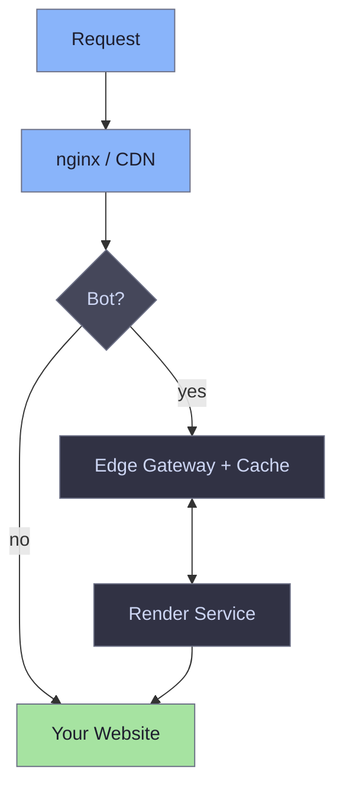
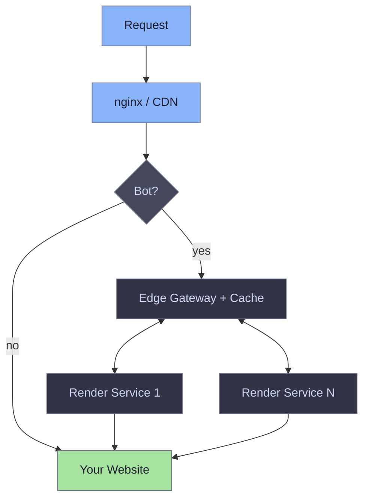
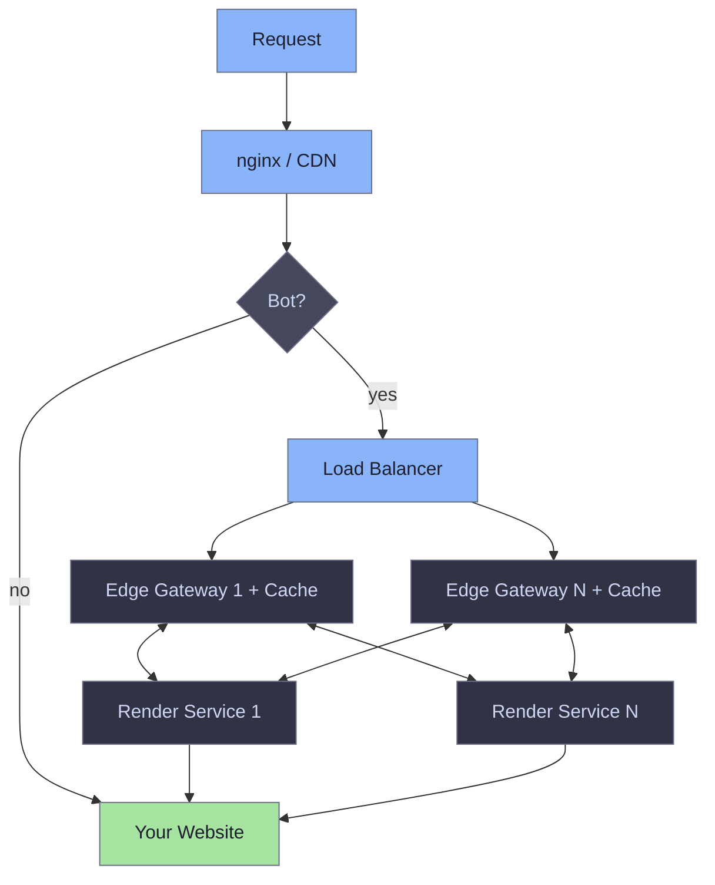

# Deployment topology

EdgeComet supports flexible deployment patterns, from a single machine setup for development to distributed clusters for high-traffic production environments.

## Components overview

- **Edge Gateway (EG)**: Manages authentication, bot detection, and cache coordination.
- **Render Service (RS)**: Executes JavaScript using headless Chrome to generate static HTML.
- **Redis**: Handles service discovery, distributed locking, and cache metadata.
- **Filesystem**: Provides persistent storage for rendered HTML content.

## Single machine

All components run on one server. Standard for local development, testing, and low-traffic sites.

**Characteristics:**
- Minimizes setup and maintenance overhead.
- Constrained by single-node resource limits.
- Lacks redundancy for production failover.

## Single gateway with multiple render services

One Edge Gateway distributes rendering work across multiple Render Service instances. This setup balances scaling needs with architectural simplicity.

If a Render Service requires maintenance or encounters Chrome-related issues, you can restart individual instances without interrupting the entire system.

**Characteristics:**
- Scales render capacity horizontally.
- Provides a single point of entry for configuration.
- Allows Render Services to run on dedicated hardware.

## Multiple gateways with sharding

Primary configuration for high-traffic production environments. Two or more Edge Gateways handle incoming traffic, manage Render Services, and share cache metadata via Redis.

**Characteristics:**
- Eliminates single points of failure.
- Distributes cache across gateway nodes for high availability.
- Coordinates via Redis to maintain cache consistency.
- Supports high-concurrency production deployments.

Cache sharding uses consistent hashing to route requests to the appropriate gateway node. See [cache sharding configuration](../edge-gateway/sharding.md) for setup details.