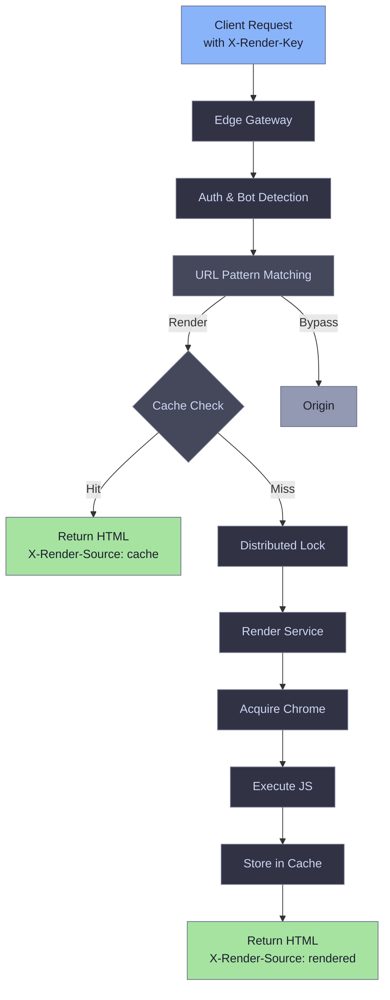

# What is EdgeComet?

EdgeComet transforms dynamic JavaScript applications into pre-rendered HTML for search engines and AI assistants, ensuring your content is crawlable, indexable, and accessible to Googlebots and AI systems. The system uses headless Chrome to execute JavaScript and render pages on demand, with intelligent caching to serve subsequent requests at high speed.

EdgeComet survives component failures and provides graceful degradation. Even during Redis outages, missing cache files, or Chrome pool breakdowns, it continues to serve requests.

### Purpose and goals

- **Deliver pre-rendered HTML**: Search engine bots and AI assistants receive fully rendered content without executing JavaScript
- **Render with high performance**: JavaScript-heavy pages rendered using headless Chrome with optimal performance
- **Deliver AI-ready content**: Ensure modern AI assistants (ChatGPT, Claude, Perplexity) can properly understand and cite your content

### Key features

- **Headless Chrome-based rendering**: Full JavaScript execution with automatic resource blocking for optimal performance
- **Intelligent caching**: Smart identification of search engines and AI assistant crawlers with bot-triggered cache refresh with flexible cache TTL
- **Distributed cache sharding**: Multi-instance deployments with hash-based cache distribution for high availability
- **Flexible URL pattern matching**: Exact, wildcard, and regexp patterns with query parameter matching support
- **Multi-dimensional device targeting**: Separate cache entries for desktop, mobile with device-specific rendering for old websites
- **Chrome pool management**: Reusable Chrome instances with automatic lifecycle management and restart policies
- **Stale cache serving**: Serve expired cache while revalidating in background to minimize latency
- **Production monitoring**: Prometheus metrics, structured logging, distributed tracing

### Request flow

EdgeComet uses a multi-service architecture with clear separation of concerns:

## System requirements

### Hardware requirements

The system is designed to be thin and resource-light. The main consumer is the Chrome rendering pool.

Minimum production requirements: 4-core CPU and 8-16GB of RAM to run 10 rendering threads. The exact load is dependent on how heavy the rendering is. For storage, SSD is recommended.

### Software requirements

**Redis 6.0+**: Coordination and metadata storage

**Latest Chrome/Chromium**: Headless mode for rendering

**Operating System**: Linux
- Production: Ubuntu LTS recommended
- Development: macOS supported

## Architecture overview

EdgeComet implements a three-tier architecture with specialized services for each concern. The design emphasizes performance, scalability, and operational simplicity while providing production-grade reliability features.

### Edge Gateway

**Edge Gateway** is the entry point of the system, built on FastHTTP for maximum performance. It manages authentication, performs bot detection, and applies URL pattern matching with automatic rule prioritization based on specificity.

The gateway coordinates cache operations, using Redis for metadata storage and the filesystem for rendered HTML. It routes requests to available Render Service instances through the service registry.

To ensure high availability and low latency, the Edge Gateway implements distributed locking and can serve stale cache content while revalidating it in the background. It also supports cache sharding for multi-instance deployments and exposes Prometheus metrics on a dedicated port for real-time monitoring.

### Render Service

**Render Service** is responsible for managing the Chrome rendering pool and executing page renders. It handles the lifecycle management of Chrome instances, including automatic restarts, health checks, and concurrency control.

During rendering, it performs full JavaScript execution with configurable timeouts and wait conditions. The service blocks unnecessary resources - such as images, fonts, and analytics scripts - to improve performance. It captures the final rendered HTML along with metadata such as status codes, headers, and redirect chains.

### Cache Daemon

**Cache Daemon** is an optional background service responsible for automatic recaching and cache invalidation. It uses bot-triggered recaching with configurable intervals to keep frequently accessed content fresh.
To maintain system efficiency, the Cache Daemon supports configurable concurrency, rate limiting, and resource control, ensuring consistent performance during large-scale recache operations.

## Deployment topology options

**Single machine (development/testing)**: Run all services on one machine with shared Redis and a single Chrome pool. Use this topology for development, testing, and low-traffic sites.

**Distributed (production)**: Deploy Edge Gateway alongside Render Services, using multiple Render Service instances to scale Chrome capacity. Dedicate machines to Cache Daemon (optional) and Redis with persistence enabled.

**High availability (enterprise)**: Deploy multiple Edge Gateway instances with cache sharding and multiple Render Service instances. Use Redis cluster or sentinel for redundancy and place a load balancer in front of Edge Gateway instances.

## Community and support

### Contributing

Contribution guidelines are being developed. This project follows standard Go conventions and uses Ginkgo for testing.

Key development standards:

- Go 1.21+ with standard formatting (gofmt, goimports)
- Ginkgo/Gomega for BDD-style testing
- Structured logging with Zap (no obvious comments, critical parts only)
- Error handling with wrapped errors and context
- Test after implementation, not before
- DRY principle and code reuse

### License

Apache-2.0