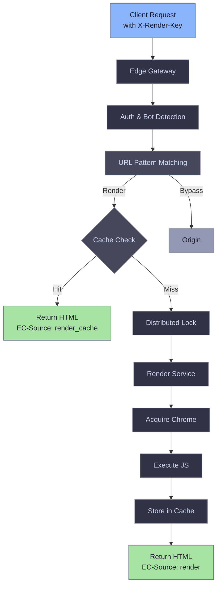

# What is the EdgeComet engine?

The EdgeComet engine is the open-source core of the EdgeComet platform: three
services that sit in the request path between your site and bot traffic. Edge
Gateway answers bot requests from cache, Render Service executes JavaScript in
headless Chrome when a page needs it, and the optional Cache Daemon keeps the
cache fresh.

Search engines (Googlebot, Bingbot) and AI crawlers (GPTBot, ClaudeBot,
PerplexityBot) receive complete HTML without your origin rendering the page on
every request. Cache hits are served from the filesystem in under 15ms.

The engine degrades gracefully under component failure. Redis outages, missing
cache files, and Chrome pool breakdowns each have a fallback path, and requests
continue to be served.

The engine is published under Apache-2.0. Run it yourself, or use the managed
service documented at [edgecomet.com/docs](https://edgecomet.com/docs/).

## What the engine does

- **Bot-aware caching (core)**: Every bot request is answered from cache, with
  flexible TTL, per-pattern rules, and bot-triggered refresh. Cache hits are read
  from the filesystem at thousands of requests per second, which keeps crawl load
  off your origin and lets bots cover more pages in the same window
- **Automatic pre-caching**: Cache Daemon recaches frequently crawled pages on
  idle capacity, keeping popular URLs fresh without re-rendering the whole site
- **Stale cache serving**: Expired content is served while a fresh render runs in
  the background, absorbing origin and render failures
- **Distributed cache sharding**: Hash-based cache distribution across multiple
  instances for storage scalability and high availability
- **JavaScript rendering**: Headless Chrome executes the page when it needs it,
  with configurable wait conditions, resource blocking, and an optional scroll
  pass for content that mounts only on scroll
- **Flexible URL pattern matching**: Exact, wildcard, and regexp patterns with
  query parameter matching, prioritized by specificity
- **Multi-dimensional device targeting**: Separate cache entries for desktop and
  mobile with device-specific rendering for old websites
- **Chrome pool management**: Reusable Chrome instances with automatic lifecycle
  management and restart policies
- **Production monitoring**: Prometheus metrics, structured logging, distributed
  tracing
- **Open source (Apache-2.0)**: Inspect, self-host, and extend the full engine

## Request flow

EdgeComet uses a multi-service architecture with clear separation of concerns:

```mermaid
flowchart TD
    %% Theme Colors
    classDef entry fill:#89B4FA,color:#1E1E2E,stroke:#6C7086
    classDef process fill:#313244,color:#CDD6F4,stroke:#6C7086
    classDef decision fill:#45475A,color:#CDD6F4,stroke:#6C7086
    classDef success fill:#A6E3A1,color:#1E1E2E,stroke:#6C7086
    classDef direct fill:#9399B2,color:#1E1E2E,stroke:#6C7086

    Client[Client Request<br/>with X-Render-Key]:::entry --> EG[Edge Gateway]:::process
    EG --> Auth[Auth & Bot Detection]:::process
    Auth --> URL[URL Pattern Matching]:::decision

    URL -->|Render| CacheCheck{Cache Check}:::decision
    URL -->|Bypass| Origin[Origin]:::direct

    CacheCheck -->|Hit| ReturnCache[Return HTML<br/>EC-Source: render_cache]:::success
    CacheCheck -->|Miss| Lock[Distributed Lock]:::process

    Lock --> Render[Render Service]:::process
    Render --> Chrome[Acquire Chrome]:::process
    Chrome --> Exec[Execute JS]:::process
    Exec --> Store[Store in Cache]:::process
    Store --> ReturnRender[Return HTML<br/>EC-Source: render]:::success
```

## System requirements

### Hardware requirements

The system is designed to be thin and resource-light. The main consumer is the Chrome rendering pool.

Minimum production requirements: 4-core CPU and 8-16GB of RAM to run 10 rendering threads. The exact load is dependent on how heavy the rendering is. For storage, SSD is recommended.

### Software requirements

**Redis 6.0+**: Coordination and metadata storage

**Latest Chrome/Chromium**: Headless mode for rendering

**Operating System**: Linux
- Production: Ubuntu LTS recommended
- Development: macOS supported

## Architecture overview

EdgeComet implements a three-tier architecture with specialized services for each concern. The design emphasizes performance, scalability, and operational simplicity while providing production-grade reliability features.

### Edge Gateway

**Edge Gateway** is the entry point of the system, built on FastHTTP for maximum performance. It manages authentication, performs bot detection, and applies URL pattern matching with automatic rule prioritization based on specificity.

The gateway coordinates cache operations, using Redis for metadata storage and the filesystem for rendered HTML. It routes requests to available Render Service instances through the service registry.

To ensure high availability and low latency, the Edge Gateway implements distributed locking and can serve stale cache content while revalidating it in the background. It also supports cache sharding for multi-instance deployments and exposes Prometheus metrics on a dedicated port for real-time monitoring.

### Render Service

**Render Service** is responsible for managing the Chrome rendering pool and executing page renders. It handles the lifecycle management of Chrome instances, including automatic restarts, health checks, and concurrency control.

During rendering, it performs full JavaScript execution with configurable timeouts and wait conditions. The service blocks unnecessary resources - such as images, fonts, and analytics scripts - to improve performance. It captures the final rendered HTML along with metadata such as status codes, headers, and redirect chains.

### Cache Daemon

**Cache Daemon** is an optional background service responsible for automatic recaching and cache invalidation. It uses bot-triggered recaching with configurable intervals to keep frequently accessed content fresh.
To maintain system efficiency, the Cache Daemon supports configurable concurrency, rate limiting, and resource control, ensuring consistent performance during large-scale recache operations.

## Deployment topology options

**Single machine (development/testing)**: Run all services on one machine with shared Redis and a single Chrome pool. Use this topology for development, testing, and low-traffic sites.

**Distributed (production)**: Deploy Edge Gateway alongside Render Services, using multiple Render Service instances to scale Chrome capacity. Dedicate machines to Cache Daemon (optional) and Redis with persistence enabled.

**High availability (enterprise)**: Deploy multiple Edge Gateway instances with cache sharding and multiple Render Service instances. Use Redis cluster or sentinel for redundancy and place a load balancer in front of Edge Gateway instances.

## Part of the broader EdgeComet platform

This repository is the engine: Edge Gateway, Render Service, and Cache Daemon.
Together they handle caching, pre-caching, and rendering in the bot request
path, and you can run them yourself under Apache-2.0.

The managed EdgeComet platform runs this same engine and adds modules that are
not part of this repository:

- **Bot analytics**: per-bot crawl behavior and crawl waste from real in-path
  traffic
- **Continuous site audit**: indexation, on-page tags, canonicals, hreflang, and
  internal linking, computed from the pages bots actually received
- **Search analytics**: Google Search Console data joined with EdgeComet's own
  page data
- **Edge SEO**: change titles, meta descriptions, canonicals, hreflang,
  redirects, and page elements without a deploy
- **Action Board**: an AI agent that ranks issues by the traffic at stake and
  drafts the fix
- **Alerts**: anomaly detection on live bot traffic

Run the engine on its own, or read the [platform
documentation](https://edgecomet.com/docs/) when you want these modules without
operating the infrastructure yourself.

## Community and support

### Contributing

Contribution guidelines are being developed. This project follows standard Go conventions and uses Ginkgo for testing.

Key development standards:

- Go 1.21+ with standard formatting (gofmt, goimports)
- Ginkgo/Gomega for BDD-style testing
- Structured logging with Zap (no obvious comments, critical parts only)
- Error handling with wrapped errors and context
- Test after implementation, not before
- DRY principle and code reuse

### License

Apache-2.0