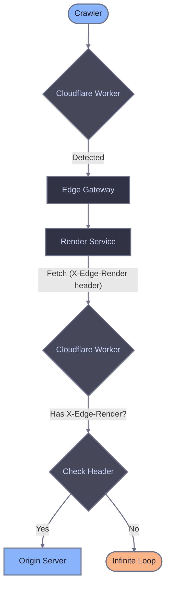

# Cloudflare Worker reference

This page provides detailed explanations of the Cloudflare Worker script components. For installation and setup, see the [main Cloudflare Worker guide](./cloudflare-worker).

## Crawler detection approaches

Both approaches route only crawler traffic to Edge Gateway. Regular users always go directly to origin. The difference is how crawlers are identified:

| Approach | Description | Use when |
|----------|-------------|----------|
| Broad (default) | Generic keywords (bot, crawl, spider) + explicit patterns | You want to catch more crawlers including unknown ones |
| Conservative | Explicit list of known crawlers | You want predictable behavior with no false positives |

### Broad detection (default)

Catches crawlers using generic keywords plus explicit patterns for crawlers without these keywords in their name.

```javascript
function isCrawler(userAgent) {
  if (!userAgent) return false;

  const patterns = [
    // Generic crawler keywords
    /bot/i,
    /crawl/i,
    /spider/i,
    /slurp/i,

    // Crawlers without generic keywords in name
    /WhatsApp/i,
    /Snapchat/i,
    /facebookexternalhit/i,
    /AMZN-User/i,
    /Claude-User/i,
    /Perplexity-User/i,
    /ChatGPT-User/i,
  ];

  return patterns.some(pattern => pattern.test(userAgent));
}
```

### Conservative detection

Explicit patterns for known search engines, AI crawlers, social media, and messengers based on [bot aliases](/edge-gateway/dimensions#available-aliases).

To use this approach, uncomment the conservative function and comment out the broad detection function in your Worker script.

```javascript
function isCrawler(userAgent) {
  if (!userAgent) return false;

  const patterns = [
    // Search engines
    /Googlebot/i,
    /bingbot/i,

    // AI crawlers
    /ChatGPT-User/i,
    /GPTBot/i,
    /OAI-SearchBot/i,
    /PerplexityBot/i,
    /Perplexity-User/i,
    /ClaudeBot/i,
    /Claude-User/i,
    /Claude-SearchBot/i,
    /Amazonbot/i,
    /AMZN-User/i,

    // Google Ads bots
    /AdsBot-Google/i,
    /AdsBot-Google-Mobile/i,

    // Social media
    /facebookexternalhit/i,
    /twitterbot/i,
    /Pinterestbot/i,
    /Applebot/i,
    /LinkedInBot/i,

    // Messengers
    /WhatsApp/i,
    /Telegrambot/i,
    /ViberBot/i,
    /Snapchat/i,
    /Discordbot/i,
    /Slackbot/i,
  ];

  return patterns.some(pattern => pattern.test(userAgent));
}
```

## Static asset detection

The Worker skips rendering for static files to avoid unnecessary requests to Edge Gateway:

```javascript
const STATIC_EXTENSIONS = /\.(avif|css|eot|gif|gz|ico|jpeg|jpg|js|json|map|mp3|mp4|ogg|otf|pdf|png|svg|ttf|txt|wasm|wav|webm|webp|woff|woff2|xml|zip)$/i;

function isStaticAsset(pathname) {
  return STATIC_EXTENSIONS.test(pathname);
}
```

This saves a network round-trip for requests that never need rendering.

## Loop prevention

When Edge Gateway renders a page, the Render Service fetches the target URL from your origin server. Without loop prevention, Cloudflare would detect the Render Service request as a crawler and route it back to Edge Gateway, creating an infinite loop.

The Render Service adds an `X-Edge-Render` header to outgoing requests. The Worker detects this header and passes the request directly to origin:

```javascript
if (request.headers.get("X-Edge-Render")) {
  return fetch(request);
}
```



## Error handling

The Worker implements fail-open behavior. If Edge Gateway is unavailable or returns a server error, the request falls back to origin:

```javascript
try {
  const response = await fetch(renderUrl, { /* ... */ });

  // If Edge Gateway returns 5xx, fall back to origin
  if (!response.ok && response.status >= 500) {
    return fetch(request);
  }

  return response;

} catch (error) {
  // On timeout or network error, fall back to origin
  return fetch(request);
}
```

This ensures crawlers receive content even if Edge Gateway is temporarily unavailable. They get unrendered JavaScript content rather than an error page.

## Headers reference

### Headers sent to Edge Gateway

| Header | Description |
|--------|-------------|
| `X-Render-Key` | Authentication token from host configuration. |
| `User-Agent` | Original client User-Agent for dimension matching. |
| `X-Forwarded-For` | Original client IP address. |
| `X-Forwarded-Proto` | Original request protocol (http/https). |

## Related documentation

- [Cloudflare Worker setup](./cloudflare-worker) - Installation and configuration
- [Diagnostic headers](/edge-gateway/x-headers) - Response header reference
- [Dimensions](/edge-gateway/dimensions) - Crawler detection via User-Agent matching
