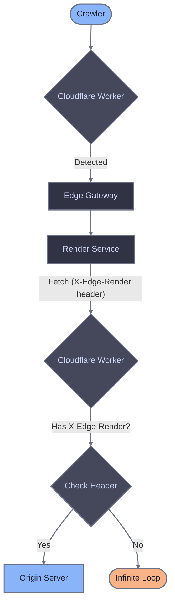

# Cloudflare Worker reference

This page provides detailed explanations of the Cloudflare Worker script components. For installation and setup, see the [main Cloudflare Worker guide](./cloudflare-worker).

## Crawler detection approaches

Both approaches route only crawler traffic to Edge Gateway. Regular users always go directly to origin. The difference is how crawlers are identified:

| Approach | Description | Use when |
|----------|-------------|----------|
| Broad (default) | Generic keywords (bot, crawl, spider) + explicit patterns | You want to catch more crawlers including unknown ones |
| Conservative | Explicit list of known crawlers | You want predictable behavior with no false positives |

### Broad detection (default)

Catches crawlers using generic keywords plus explicit patterns for crawlers without these keywords in their name.

```javascript
function isCrawler(userAgent) {
  if (!userAgent) return false;

  const patterns = [
    // Generic crawler keywords
    /bot/i,
    /crawl/i,
    /spider/i,
    /slurp/i,

    // Crawlers without generic keywords in name
    /WhatsApp/i,
    /Snapchat/i,
    /facebookexternalhit/i,
    /AMZN-User/i,
    /Claude-User/i,
    /Perplexity-User/i,
    /ChatGPT-User/i,
  ];

  return patterns.some(pattern => pattern.test(userAgent));
}
```

### Conservative detection

Explicit patterns for known search engines, AI crawlers, social media, and messengers based on [bot aliases](/edge-gateway/dimensions#available-aliases).

To use this approach, uncomment the conservative function and comment out the broad detection function in your Worker script.

```javascript
function isCrawler(userAgent) {
  if (!userAgent) return false;

  const patterns = [
    // Search engines
    /Googlebot/i,
    /bingbot/i,

    // AI crawlers
    /ChatGPT-User/i,
    /GPTBot/i,
    /OAI-SearchBot/i,
    /OAI-AdsBot/i,
    /PerplexityBot/i,
    /Perplexity-User/i,
    /ClaudeBot/i,
    /Claude-User/i,
    /Claude-SearchBot/i,
    /Amazonbot/i,
    /AMZN-User/i,
    /Google-Agent/i,

    // Google Ads bots
    /AdsBot-Google/i,
    /AdsBot-Google-Mobile/i,

    // Social media
    /facebookexternalhit/i,
    /twitterbot/i,
    /Pinterestbot/i,
    /Applebot/i,
    /LinkedInBot/i,

    // Messengers
    /WhatsApp/i,
    /Telegrambot/i,
    /ViberBot/i,
    /Snapchat/i,
    /Discordbot/i,
    /Slackbot/i,
  ];

  return patterns.some(pattern => pattern.test(userAgent));
}
```

## Static asset detection

The Worker skips rendering for static files to avoid unnecessary requests to Edge Gateway:

```javascript
const STATIC_EXTENSIONS = /\.(avif|css|eot|gif|gz|ico|jpeg|jpg|js|json|map|mp3|mp4|ogg|otf|pdf|png|svg|ttf|txt|wasm|wav|webm|webp|woff|woff2|xml|zip)$/i;

function isStaticAsset(pathname) {
  return STATIC_EXTENSIONS.test(pathname);
}
```

This saves a network round-trip for requests that never need rendering.

## Request methods

Only `GET` and `HEAD` reach Edge Gateway. Any other method is forwarded straight to origin, so a `POST`, `PUT` or `DELETE` from a client whose User-Agent matches the crawler patterns still reaches your application with its body intact.

`HEAD` is forwarded as `HEAD`. Edge Gateway serves it from the same cache entry as the equivalent `GET` - the cache key does not include the method - and answers with the real status, `EC-Source` and `Content-Length` while writing no body, so a crawler checking a URL sees exactly what a `GET` would have returned.

## Loop prevention

When Edge Gateway renders a page, the Render Service fetches the target URL from your origin server. Without loop prevention, Cloudflare would detect the Render Service request as a crawler and route it back to Edge Gateway, creating an infinite loop.

EdgeComet adds an `X-Edge-Render` header to its outgoing requests, both from the Render Service (Chrome fetches) and the Edge Gateway (bypass fetches, including bypass pre-cache). The Worker detects this header and passes the request directly to origin:

```javascript
if (request.headers.get("X-Edge-Render")) {
  return fetch(request);
}
```


```mermaid
flowchart TD
    %% Palette Definitions
    classDef entry fill:#89B4FA,stroke:#6C7086,stroke-width:2px,color:#1E1E2E;
    classDef process fill:#313244,stroke:#6C7086,stroke-width:2px,color:#CDD6F4;
    classDef decision fill:#45475A,stroke:#6C7086,stroke-width:2px,color:#CDD6F4;
    classDef failure fill:#FAB387,stroke:#6C7086,stroke-width:2px,color:#1E1E2E;

    Crawler([Crawler]) --> CF1{Cloudflare Worker}
    CF1 -- "Detected" --> EG[Edge Gateway]
    EG --> RS[Render Service]
    RS -- "Fetch (X-Edge-Render header)" --> CF2{Cloudflare Worker}

    CF2 -- "Has X-Edge-Render?" --> Check{Check Header}
    Check -- Yes --> Origin[Origin Server]
    Check -- No --> Failure([Infinite Loop])

    class Crawler,Origin entry;
    class EG,RS process;
    class CF1,CF2,Check decision;
    class Failure failure;

    linkStyle default stroke:#6C7086,stroke-width:2px;
```

## Error handling

The Worker implements fail-open behavior. If Edge Gateway is unavailable or returns a server error, the request falls back to origin:

```javascript
try {
  const response = await fetch(renderUrl, { /* ... */ });

  // If Edge Gateway returns 5xx, fall back to origin
  if (!response.ok && response.status >= 500) {
    return fetch(request);
  }

  return response;

} catch (error) {
  // On timeout or network error, fall back to origin
  return fetch(request);
}
```

This ensures crawlers receive content even if Edge Gateway is temporarily unavailable. They get unrendered JavaScript content rather than an error page.

## Header forwarding

The Worker forwards the crawler's request headers to Edge Gateway unchanged. Two things depend on it:

- `headers.safe_request` is an allow-list applied to the request that arrives, so it can only forward to your origin a header the bot actually sent. A header the Worker drops can never be allow-listed back.
- `events.request_headers` records hop 1 of the request - what the bot sent us. It is only evidence if the Worker passes the request through.

### Headers the Worker does not forward

These belong to the connection the request arrived on, not to the one the Worker opens. nginx replaces or drops the same set on its own hop.

| Header | Reason |
|--------|--------|
| `Host` | Belongs to this hop; the crawler's host is carried in the `url` parameter. |
| `Connection`, `Keep-Alive`, `TE`, `Trailer`, `Transfer-Encoding`, `Upgrade` | Hop-by-hop. |
| `Proxy-Authorization`, `Proxy-Authenticate` | Address the proxy, not the origin. |
| `Content-Length` | The Worker sends a GET with no body. |

### Headers the Worker sets

Applied after the crawler's headers, so a client-supplied header of the same name cannot override them.

| Header | Value |
|--------|-------|
| `X-Render-Key` | Authentication token from host configuration. |
| `X-Forwarded-Proto` | Original request protocol (http/https). |
| `X-Real-IP`, `X-Forwarded-For` | `CF-Connecting-IP` - the one client IP Cloudflare vouches for. An inbound `X-Forwarded-For` chain is client-supplied and its leftmost entry, the one Edge Gateway reads, is spoofable, so it is replaced rather than extended. |
| `EC-Request-ID` | `CF-Ray`, so a Cloudflare request and an EdgeComet event share an id. |
| `Accept-Encoding` | `request.cf.clientAcceptEncoding`. Cloudflare canonicalizes `Accept-Encoding` before the Worker runs, so the inbound value is Cloudflare's rather than the crawler's. |

`User-Agent` needs no special handling: it arrives with the crawler's headers and reaches Edge Gateway for dimension matching untouched.

Requests reaching Edge Gateway through Cloudflare also carry the `CF-*` headers Cloudflare adds at its edge (`CF-Ray`, `CF-Connecting-IP`, `CF-IPCountry`, `CF-Visitor`). They are stored in `events.request_headers` alongside the crawler's own headers.

## Related documentation

- [Cloudflare Worker setup](./cloudflare-worker) - Installation and configuration
- [Diagnostic headers](/edge-gateway/x-headers) - Response header reference
- [Dimensions](/edge-gateway/dimensions) - Crawler detection via User-Agent matching
