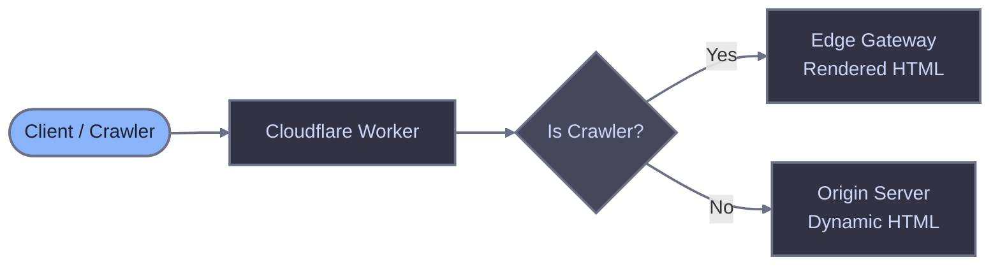

# Cloudflare Worker

Configure a Cloudflare Worker to route crawler traffic through Edge Gateway for server-side rendering of JavaScript-heavy pages.

## Prerequisites

- Running Edge Gateway instance (see [Quick Start](/quick-start))
- Configured host with `render_key` and `domain`
- Cloudflare account with Workers enabled
- Domain proxied through Cloudflare (orange cloud icon in DNS settings)

## How it works

A Cloudflare Worker sits at the edge and intercepts incoming requests. When a crawler requests a page, the Worker routes the request to Edge Gateway for pre-rendered HTML. Regular users go directly to your origin server, preserving cookies, sessions, and authentication.



## Worker script

Copy this script into your Cloudflare Worker and edit the configuration constants at the top.

::: code-group

```javascript [worker.js]
// =============================================================================
// CONFIGURATION - Edit these values
// =============================================================================

const CONFIG = {
  // Your Edge Gateway URL (e.g., "https://render.example.com")
  EDGE_GATEWAY_URL: "https://render.example.com",

  // Your render key from host configuration
  RENDER_KEY: "your_render_key_here",

  // Request timeout in milliseconds (default: 60 seconds)
  TIMEOUT: 60000,
};

// =============================================================================
// CRAWLER DETECTION
// For alternative options, see the Worker reference documentation
// =============================================================================
function isCrawler(userAgent) {
  if (!userAgent) return false;

  const patterns = [
    // Generic crawler keywords
    /bot/i,
    /crawl/i,
    /spider/i,
    /slurp/i,

    // Crawlers without generic keywords in name
    /WhatsApp/i,
    /Snapchat/i,
    /facebookexternalhit/i,
    /AMZN-User/i,
    /Claude-User/i,
    /Perplexity-User/i,
    /ChatGPT-User/i,
  ];

  return patterns.some(pattern => pattern.test(userAgent));
}

// =============================================================================
// STATIC ASSET DETECTION
// =============================================================================

const STATIC_EXTENSIONS = /\.(avif|css|eot|gif|gz|ico|jpeg|jpg|js|json|map|mp3|mp4|ogg|otf|pdf|png|svg|ttf|txt|wasm|wav|webm|webp|woff|woff2|xml|zip)$/i;

function isStaticAsset(pathname) {
  return STATIC_EXTENSIONS.test(pathname);
}

// =============================================================================
// MAIN HANDLER
// =============================================================================

export default {
  async fetch(request, env, ctx) {
    const url = new URL(request.url);
    const userAgent = request.headers.get("User-Agent") || "";

    // Loop prevention: if request is from Render Service, pass to origin
    if (request.headers.get("X-Edge-Render")) {
      return fetch(request);
    }

    // Skip static assets
    if (isStaticAsset(url.pathname)) {
      return fetch(request);
    }

    // Only route crawlers to Edge Gateway
    if (!isCrawler(userAgent)) {
      return fetch(request);
    }

    // Build Edge Gateway request
    const renderUrl = `${CONFIG.EDGE_GATEWAY_URL}/render?url=${encodeURIComponent(request.url)}`;

    const controller = new AbortController();
    const timeoutId = setTimeout(() => controller.abort(), CONFIG.TIMEOUT);

    try {
      const response = await fetch(renderUrl, {
        method: "GET",
        headers: {
          "X-Render-Key": CONFIG.RENDER_KEY,
          "User-Agent": userAgent,
          "X-Forwarded-For": request.headers.get("CF-Connecting-IP") || "",
          "X-Forwarded-Proto": url.protocol.replace(":", ""),
        },
        signal: controller.signal,
      });

      clearTimeout(timeoutId);

      // If Edge Gateway returns error, fall back to origin
      if (!response.ok && response.status >= 500) {
        return fetch(request);
      }

      return response;

    } catch (error) {
      clearTimeout(timeoutId);
      // On timeout or network error, fall back to origin
      return fetch(request);
    }
  },
};
```

:::

## Configuration

| Constant | Required | Description |
|----------|----------|-------------|
| `EDGE_GATEWAY_URL` | Yes | Full URL to your Edge Gateway instance. |
| `RENDER_KEY` | Yes | Authentication token from host configuration. |
| `TIMEOUT` | No | Request timeout in milliseconds (default: 60000). |

Set `TIMEOUT` higher than your Edge Gateway's `render.timeout` configuration to allow renders to complete.

For detailed explanations of crawler detection options, loop prevention, and error handling, see the [Worker reference](./cloudflare-worker-reference).

## Cloudflare settings

Review these Cloudflare settings to ensure they do not interfere with crawler traffic or Edge Gateway requests.

### Bot Fight Mode

**Recommendation**: Review and test

Bot Fight Mode may interfere with legitimate crawlers. If you notice crawlers being blocked, review your bot management settings.

**Location**: Security > Settings > Bot traffic > Bot Fight Mode

### Under Attack Mode

**Recommendation**: Use temporarily only

Under Attack Mode presents a JavaScript challenge to all visitors, including crawlers. Only enable during active attacks and disable promptly.

**Location**: Overview > Quick Actions > Under Attack Mode

## Installation

### Option A: Cloudflare Dashboard

1. Verify your domain's DNS is proxied through Cloudflare:
   - Go to your domain's **DNS** > **Records**
   - Confirm the A record shows the orange cloud icon (Proxied)
   - If it shows a gray cloud (DNS only), click to enable proxying


2. Log in to the [Cloudflare Dashboard](https://dash.cloudflare.com)

3. Navigate to **Compute & AI** > **Workers & Pages** in the sidebar

4. Click **Create application**


5. Select **Start with Hello World!**


6. Enter a name for your Worker (e.g., `edge-gateway-router`) and click **Deploy**


7. After deployment, click **Edit code** to open the editor


8. Replace all code with the [Worker script](#worker-script) and update the configuration:
   - Set `EDGE_GATEWAY_URL` to your Edge Gateway URL
   - Set `RENDER_KEY` to your host's render key


9. Click **Deploy** to save your changes

10. Go to your domain, then navigate to **Workers Routes** (under Workers & Pages in the sidebar)


11. Click **Add route** and configure:
    - **Route**: `your-domain.com/*` (your domain with wildcard)
    - **Worker**: Select the Worker you created
    - **Failure mode**: Select **Fail open (proceed)** to ensure users reach your origin if the Worker fails


12. Click **Save**

### Option B: Wrangler CLI

For developers who prefer command-line deployment or want version control.

1. Verify your domain's DNS is proxied through Cloudflare (orange cloud icon in DNS settings)

2. Install Wrangler:

```bash
npm install -g wrangler
```

3. Authenticate with Cloudflare:

```bash
wrangler login
```

4. Create a project directory:

```bash
mkdir edge-gateway-worker && cd edge-gateway-worker
```

5. Create `wrangler.toml`:

```toml
name = "edge-gateway-router"
main = "worker.js"
compatibility_date = "2024-01-01"

routes = [
  { pattern = "*example.com/*", zone_name = "example.com" }
]
```

6. Create `worker.js` with the [Worker script](#worker-script)

7. Edit the configuration constants in `worker.js`

8. Deploy:

```bash
wrangler deploy
```

## Verifying the setup

### Test with jsbug

Use [jsbug.org](https://jsbug.org) to verify that crawlers receive rendered content:

1. Enter your page URL
2. Click the settings icon and select **Googlebot** as the User-Agent
3. Click **Analyze**

The **JS Rendered** panel shows what Edge Gateway returns to crawlers. Compare it with the **Non JS** panel to confirm JavaScript content is being rendered.


### Monitor Worker requests

After testing, check your Worker metrics to confirm requests are being processed:

1. Go to **Workers & Pages** in the Cloudflare Dashboard
2. Select your Worker
3. View the **Metrics** section


### Test with curl (alternative)

For command-line testing, send a request with a crawler User-Agent:

```bash
curl -v \
  -H "User-Agent: Mozilla/5.0 (compatible; Googlebot/2.1; +http://www.google.com/bot.html)" \
  "https://example.com/"
```

Check response headers:
- `X-Render-Source: rendered` or `X-Render-Source: cache` confirms Edge Gateway processed the request

Test regular user traffic goes directly to origin:

```bash
curl -v \
  -H "User-Agent: Mozilla/5.0 (Macintosh; Intel Mac OS X 10_15_7) AppleWebKit/537.36" \
  "https://example.com/"
```

Request should have no `X-Render-*` headers in response.

## Worker requests

Cloudflare's free tier includes 100,000 Worker requests per day. All HTTP requests count toward this limit, not just page requests. Each page load can trigger tens or hundreds of additional requests for JavaScript, CSS, images, and other resources, consuming your quota quickly.

### Reducing request count

If your static assets are served from dedicated paths (e.g., `/images/`, `/js/`, `/css/`, `/assets/`), you can create routes that bypass the Worker:

1. Go to **Workers Routes** in your domain settings
2. Click **Add route**
3. Enter the asset path pattern (e.g., `*example.com/assets/*`)
4. Set the **Worker** field to **None**
5. Click **Save**
6. Repeat for each asset folder


Requests matching these routes go directly to origin without invoking the Worker. This can significantly reduce request consumption, allowing small to medium websites to stay within the free tier.

## Troubleshooting

The Worker script provided in this guide works without modification. Most issues occur when:
- Custom edits were made to the source code
- Other Workers on your domain conflict with or prevent execution of this Worker

### 403 Forbidden from Edge Gateway

- Verify `RENDER_KEY` matches your host configuration
- Check the domain in the URL matches your configured `domain`
- Confirm the host is `enabled: true`

### Timeout errors

- Increase `TIMEOUT` constant to exceed your Edge Gateway render timeout
- Check Edge Gateway logs for render failures
- Verify Render Service is running and registered

### Crawlers not being detected

- Test the User-Agent against your `isCrawler` function
- Add missing patterns to the crawler detection list
- Consider switching to the broad detection approach

### Infinite loops or repeated requests

- Verify the `X-Edge-Render` header check is present and working
- Check that no other Cloudflare settings strip this header
- Review Edge Gateway logs for the request flow

### Users seeing pre-rendered content

- Verify the crawler detection logic only matches crawlers
- Check that the User-Agent check is case-insensitive
- Test with common browser User-Agents

### Bot Fight Mode blocking crawlers

- Review Cloudflare's bot analytics to see blocked requests
- Add legitimate crawler IPs to the allowlist
- Consider adjusting Bot Fight Mode sensitivity

### Cache not working

- Verify `X-Render-Source` header shows `cache` on repeat crawler requests
- Check `X-Cache-Age` header for cache duration
- Review Edge Gateway cache configuration

## Related documentation

- [Worker reference](./cloudflare-worker-reference) - Detailed code explanations
- [Diagnostic headers](/edge-gateway/x-headers) - Response header reference
- [Dimensions](/edge-gateway/dimensions) - Crawler detection via User-Agent matching
- [Caching](/edge-gateway/caching) - Cache configuration
- [nginx integration](./nginx) - Alternative integration method
