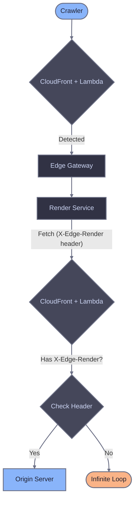

# CloudFront reference

This page provides detailed explanations of the Lambda@Edge function components. For installation and setup, see the [main CloudFront guide](./cloudfront).

## Crawler detection approaches

Both approaches route only crawler traffic to Edge Gateway. Regular users always go directly to origin. The difference is how crawlers are identified:

| Approach | Description | Use when |
|----------|-------------|----------|
| Broad (default) | Generic keywords (bot, crawl, spider) + explicit patterns | You want to catch more crawlers including unknown ones |
| Conservative | Explicit list of known crawlers | You want predictable behavior with no false positives |

### Broad detection (default)

Catches crawlers using generic keywords plus explicit patterns for crawlers without these keywords in their name. Uses a single compiled regex for fast matching in Lambda@Edge.

```javascript
const CRAWLER_PATTERN = /bot|crawl|spider|slurp|WhatsApp|Snapchat|facebookexternalhit|AMZN-User|Claude-User|Perplexity-User|ChatGPT-User/i;

function isCrawler(userAgent) {
  if (!userAgent) return false;
  return CRAWLER_PATTERN.test(userAgent);
}
```

### Conservative detection

Explicit patterns for known search engines, AI crawlers, social media, and messengers based on [bot aliases](/edge-gateway/dimensions#available-aliases).

To use this approach, replace the `CRAWLER_PATTERN` constant in your Lambda function:

```javascript
const CRAWLER_PATTERN = new RegExp(
  [
    // Search engines
    "Googlebot",
    "bingbot",

    // AI crawlers
    "ChatGPT-User",
    "GPTBot",
    "OAI-SearchBot",
    "PerplexityBot",
    "Perplexity-User",
    "ClaudeBot",
    "Claude-User",
    "Claude-SearchBot",
    "Amazonbot",
    "AMZN-User",

    // Google Ads bots
    "AdsBot-Google",
    "AdsBot-Google-Mobile",

    // Social media
    "facebookexternalhit",
    "twitterbot",
    "Pinterestbot",
    "Applebot",
    "LinkedInBot",

    // Messengers
    "WhatsApp",
    "Telegrambot",
    "ViberBot",
    "Snapchat",
    "Discordbot",
    "Slackbot",
  ].join("|"),
  "i"
);

function isCrawler(userAgent) {
  if (!userAgent) return false;
  return CRAWLER_PATTERN.test(userAgent);
}
```

## Static asset detection

The Lambda function skips rendering for static files to avoid unnecessary requests to Edge Gateway:

```javascript
const STATIC_EXTENSIONS = /\.(avif|css|eot|gif|gz|ico|jpeg|jpg|js|json|map|mp3|mp4|ogg|otf|pdf|png|svg|ttf|txt|wasm|wav|webm|webp|woff|woff2|xml|zip)$/i;

function isStaticAsset(uri) {
  return STATIC_EXTENSIONS.test(uri);
}
```

The function checks `request.uri` from the CloudFront event, which contains the path without query parameters. This saves a round-trip to Edge Gateway for requests that never need rendering.

## Loop prevention

When Edge Gateway renders a page, the Render Service fetches the target URL from your origin server. Without loop prevention, the Lambda function would detect the Render Service request as a crawler and route it back to Edge Gateway, creating an infinite loop.

The Render Service adds an `X-Edge-Render` header to all outgoing requests. The Lambda function detects this header and passes the request directly to origin:

```javascript
if (headers["x-edge-render"]) {
  return request;
}
```

For this to work, the `X-Edge-Render` header must be included in your CloudFront origin request policy. If CloudFront strips this header before it reaches the Lambda function, loop prevention fails.



## Error handling (fail-open)

The Lambda function uses origin rewriting rather than making a direct HTTP call to Edge Gateway. If Edge Gateway is unavailable, CloudFront returns a 502 or 504 error to the client. To implement fail-open behavior, use CloudFront Origin Groups.

### Origin groups (recommended)

CloudFront origin groups provide automatic failover without additional Lambda code. When Edge Gateway returns an error, CloudFront retries the request against a secondary origin, serving unrendered content to crawlers instead of an error page.

The Lambda@Edge function rewrites the origin dynamically in the request object. This does not create a persistent origin in your CloudFront distribution -- it overrides where CloudFront sends the request at runtime. On failover, CloudFront sends the request to the secondary origin **without re-executing** the Lambda function, so the request goes directly to your application server.

**Configuration**:

1. In the CloudFront console, go to **Origins** and confirm your application origin exists (e.g., `origin.example.com`)

2. Create a second CloudFront origin entry using the same server address as your application origin. CloudFront requires two distinct origin IDs for an origin group, but both can point to the same server (e.g., add an origin with ID `app-origin-failover` using the same domain name)

3. Create an **Origin group**:
   - **Primary origin**: Your application origin (the Lambda function rewrites this to Edge Gateway for crawlers)
   - **Secondary origin**: The failover origin (receives requests directly when Edge Gateway fails)
   - **Failover criteria**: 502, 503, 504

4. Update the default **Cache behavior** to use the origin group instead of a single origin

When Edge Gateway returns a failover status code, CloudFront retries the request to the secondary origin. The Lambda function does not execute again on failover, so the request goes directly to your application server and returns unrendered content.

### Lambda@Edge origin-response (advanced)

For more control over error handling, add a second Lambda@Edge function on the `origin-response` event. This function can inspect the Edge Gateway response and take action on errors:

```javascript
exports.handler = async (event) => {
  const response = event.Records[0].cf.response;
  const request = event.Records[0].cf.request;

  if (parseInt(response.status) >= 500 && request.headers["x-render-key"]) {
    console.log(
      `Edge Gateway error: ${response.status} for ${request.uri}`
    );
  }

  return response;
};
```

This approach is useful for logging and monitoring Edge Gateway errors. For automatic failover, origin groups are simpler and require no additional Lambda functions.

## CloudFront caching of rendered content

The origin rewriting approach enables CloudFront to cache Edge Gateway responses at edge locations. On repeat crawler visits to the same page, CloudFront serves the cached rendered HTML without contacting Edge Gateway, reducing latency and EG load.

### Cache key considerations

The **cache policy** (not the origin request policy) controls what CloudFront uses as the cache key. These are independent CloudFront concepts: the cache policy determines cache key composition, while the origin request policy controls which headers are forwarded to the origin.

Since the Lambda function rewrites crawler requests to `/render?url=...`, the cache key must include query strings so that each page URL produces a distinct cache entry. Without query strings in the cache key, all crawler requests would share a single cache entry.

Regular users are not affected by cached rendered content because their requests use the original URL path (e.g., `/page`), not the rewritten `/render?url=...` path. The different URL structures naturally separate the cache entries.

### Recommended cache policy

Use the `UseOriginCacheControlHeaders-QueryStrings` managed cache policy, or create a custom policy with these settings:

| Setting | Value | Reason |
|---------|-------|--------|
| **Query strings** | All | The original page URL is in the `url` query parameter. |
| **Headers** | None | Avoid splitting cache by User-Agent or other headers. |
| **Cookies** | None | Crawler requests do not use cookies. |
| **TTL** | Use origin Cache-Control headers | Edge Gateway sets appropriate `Cache-Control` values. |

### Cache-Control headers

Edge Gateway sets `Cache-Control` headers on its responses. CloudFront respects these headers when the cache policy's TTL settings use origin headers (the default for custom policies).

## Origin request policy reference

These headers must be forwarded from viewer to origin for the Lambda@Edge function to work correctly:

| Header | Required | Purpose |
|--------|----------|---------|
| `Host` | Yes | Original viewer hostname for URL reconstruction. Without this, CloudFront replaces Host with the origin domain name. |
| `User-Agent` | Yes | Original client User-Agent for crawler detection. CloudFront normalizes this by default. |
| `X-Edge-Render` | Yes | Loop prevention. Render Service sets this header on callback requests. |
| `CloudFront-Forwarded-Proto` | Yes | Original viewer protocol for URL reconstruction. |

Without the custom origin request policy, CloudFront replaces the `User-Agent` with `Amazon CloudFront` (making crawler detection impossible) and the `Host` with the origin domain (breaking URL reconstruction).

## Headers reference

### Headers sent to Edge Gateway

| Header | Description |
|--------|-------------|
| `X-Render-Key` | Authentication token from host configuration. |
| `Host` | Rewritten to Edge Gateway hostname for TLS and routing. |
| `User-Agent` | Original client User-Agent for dimension matching. |
| `X-Forwarded-For` | Original client IP address (`request.clientIp`). |
| `X-Forwarded-Proto` | Original request protocol from `CloudFront-Forwarded-Proto`. |

## Why Lambda@Edge instead of CloudFront Functions

CloudFront Functions are cheaper and faster (sub-millisecond execution), but they only run on viewer-request and viewer-response events. They cannot modify the request origin, which is required to route crawler traffic to Edge Gateway. Lambda@Edge on the origin-request event can rewrite the origin, making it the only option for this integration.

## Lambda@Edge constraints

| Constraint | Value | Impact |
|-----------|-------|--------|
| Deployment region | us-east-1 only | Function must be created in N. Virginia. |
| Environment variables | Not supported | All configuration must be embedded in code. |
| Function version | Published version required | Cannot use `$LATEST`. Publish a new version after each update. |
| Origin-request timeout | 30 seconds | Function execution limit. Origin `readTimeout` is separate. |
| Viewer-request timeout | 5 seconds | Too short for rendering. Use origin-request instead. |
| Response body limit | 1 MB (generated responses) | Does not apply to origin-rewriting (response flows from origin). |
| IAM trust policy | `edgelambda.amazonaws.com` | Required in addition to `lambda.amazonaws.com`. |
| Lambda Layers | Not supported | All dependencies must be bundled in the deployment package. |
| CloudWatch Logs region | Viewer's nearest region | Logs are not in us-east-1. Check multiple regions when debugging. |
| Deployment propagation | 5-15 minutes | CloudFront distribution updates take time to propagate globally. |

## Logging

Lambda@Edge logs appear in CloudWatch Logs in the AWS region closest to the viewer who triggered the request, not in us-east-1 where the function was created. Check multiple regions when debugging.

### Adding debug logging

Add temporary logging to the Lambda function to inspect request details:

```javascript
exports.handler = async (event) => {
  const request = event.Records[0].cf.request;
  const headers = request.headers;
  const userAgent = headers["user-agent"]
    ? headers["user-agent"][0].value
    : "";

  console.log(JSON.stringify({
    uri: request.uri,
    userAgent: userAgent,
    isCrawler: isCrawler(userAgent),
    isStatic: isStaticAsset(request.uri),
    hasEdgeRender: !!headers["x-edge-render"],
  }));

  // ... rest of handler
};
```

View logs in the CloudWatch console. Select the region closest to where you tested, and look for the log group `/aws/lambda/us-east-1.edge-gateway-router`.

### Structured logging for production

For ongoing monitoring, add a log line after the origin rewrite to track crawler routing decisions:

```javascript
if (isCrawler(userAgent)) {
  console.log(JSON.stringify({
    action: "route-to-eg",
    url: originalUrl,
    userAgent: userAgent,
    clientIp: request.clientIp,
  }));
}
```

Use CloudWatch Logs Insights to query across regions:

```
fields @timestamp, @message
| filter action = "route-to-eg"
| stats count() by bin(1h)
```

## Related documentation

- [CloudFront setup](./cloudfront) - Installation and configuration
- [Diagnostic headers](/edge-gateway/x-headers) - Response header reference
- [Dimensions](/edge-gateway/dimensions) - Crawler detection via User-Agent matching
- [Caching](/edge-gateway/caching) - Cache configuration
