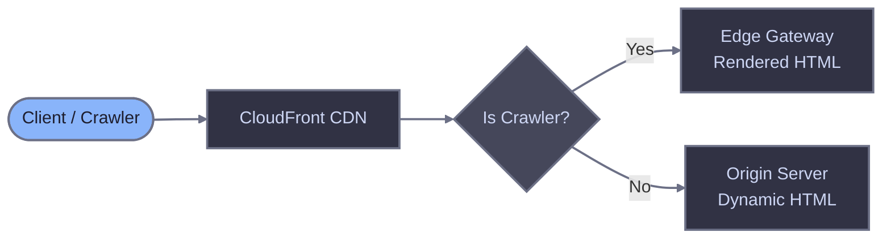

# AWS CloudFront

Configure AWS CloudFront with Lambda@Edge to route crawler traffic through Edge Gateway for server-side rendering of JavaScript-heavy pages.

## Prerequisites

- Running Edge Gateway instance (see [Quick Start](/quick-start))
- Configured host with `render_key` and `domain`
- AWS account with permissions for CloudFront, Lambda, and IAM
- Edge Gateway accessible over HTTPS from AWS edge locations

## How it works

A Lambda@Edge function runs on CloudFront's origin-request event. When a crawler requests a page, the function rewrites the origin to Edge Gateway for pre-rendered HTML. Regular users go directly to your origin server, preserving cookies, sessions, and authentication.



Edge Gateway endpoint: `GET /render?url=<target-url>`

Required header: `X-Render-Key` (from your host configuration)

## Lambda@Edge function

::: warning Lambda@Edge region requirement
Lambda@Edge functions must be created in the **us-east-1** (N. Virginia) region. This is an AWS restriction - CloudFront replicates the function globally to edge locations, but the source function must reside in us-east-1 regardless of where your other infrastructure runs.
:::

Lambda@Edge does not support environment variables, so all configuration is embedded as constants.

::: code-group

```javascript [index.js]
// =============================================================================
// CONFIGURATION - Edit these values
// =============================================================================

const CONFIG = {
  // Your Edge Gateway hostname (e.g., "render.example.com")
  EDGE_COMET_HOST: "render.example.com",

  // Your render key from host configuration
  RENDER_KEY: "your_render_key_here",
};

// =============================================================================
// CRAWLER DETECTION
// For alternative options, see the CloudFront reference documentation
// =============================================================================

const CRAWLER_PATTERN = /bot|crawl|spider|slurp|WhatsApp|Snapchat|facebookexternalhit|AMZN-User|Claude-User|Perplexity-User|ChatGPT-User/i;

function isCrawler(userAgent) {
  if (!userAgent) return false;
  return CRAWLER_PATTERN.test(userAgent);
}

// =============================================================================
// STATIC ASSET DETECTION
// =============================================================================

const STATIC_EXTENSIONS = /\.(avif|css|eot|gif|gz|ico|jpeg|jpg|js|json|map|mp3|mp4|ogg|otf|pdf|png|svg|ttf|txt|wasm|wav|webm|webp|woff|woff2|xml|zip)$/i;

function isStaticAsset(uri) {
  return STATIC_EXTENSIONS.test(uri);
}

// =============================================================================
// HANDLER (origin-request event)
// =============================================================================

exports.handler = async (event) => {
  const request = event.Records[0].cf.request;
  const headers = request.headers;
  const userAgent = headers["user-agent"]
    ? headers["user-agent"][0].value
    : "";

  // Loop prevention: if request is from Render Service, pass to origin
  if (headers["x-edge-render"]) {
    return request;
  }

  // Skip static assets
  if (isStaticAsset(request.uri)) {
    return request;
  }

  // Only route crawlers to Edge Gateway
  if (!isCrawler(userAgent)) {
    return request;
  }

  // Build the original URL from the CloudFront request
  const proto = headers["cloudfront-forwarded-proto"]
    ? headers["cloudfront-forwarded-proto"][0].value
    : "https";
  const host = headers["host"] ? headers["host"][0].value : "";
  const qs = request.querystring ? "?" + request.querystring : "";
  const originalUrl = `${proto}://${host}${request.uri}${qs}`;

  // Rewrite origin to Edge Gateway
  request.origin = {
    custom: {
      domainName: CONFIG.EDGE_COMET_HOST,
      port: 443,
      protocol: "https",
      sslProtocols: ["TLSv1.2"],
      path: "",
      readTimeout: 60,
      keepaliveTimeout: 60,
    },
  };

  // Rewrite request path to EG render endpoint
  request.uri = "/render";
  request.querystring = `url=${encodeURIComponent(originalUrl)}`;

  // Set required headers
  headers["host"] = [{ key: "Host", value: CONFIG.EDGE_COMET_HOST }];
  headers["x-render-key"] = [
    { key: "X-Render-Key", value: CONFIG.RENDER_KEY },
  ];

  // Forward client IP and protocol
  headers["x-forwarded-for"] = [
    { key: "X-Forwarded-For", value: request.clientIp || "" },
  ];
  headers["x-forwarded-proto"] = [
    { key: "X-Forwarded-Proto", value: proto },
  ];

  return request;
};
```

:::

## Configuration

| Constant | Required | Description |
|----------|----------|-------------|
| `EDGE_COMET_HOST` | Yes | Hostname of your Edge Gateway instance (without protocol). |
| `RENDER_KEY` | Yes | Authentication token from host configuration. |

Set `readTimeout` in the origin configuration higher than your Edge Gateway's `render.timeout` to allow renders to complete.

Lambda@Edge does not support environment variables, so `RENDER_KEY` is embedded in the function code. Restrict access to the Lambda function using IAM policies -- any principal with `lambda:GetFunction` permission can read the deployment package and see the key.

For detailed explanations of crawler detection options, loop prevention, and error handling, see the [CloudFront reference](./cloudfront-reference).

## CloudFront settings

Review these CloudFront settings to ensure correct behavior with Lambda@Edge.

### Origin request policy

CloudFront replaces the `Host` header with the origin domain name and normalizes `User-Agent` to a generic `Amazon CloudFront` string. The Lambda@Edge function needs both original values -- `Host` for URL reconstruction and `User-Agent` for crawler detection.

Create a custom origin request policy that forwards these headers:

| Header | Purpose |
|--------|---------|
| `Host` | Original viewer hostname for URL reconstruction. Without this, CloudFront replaces Host with the origin domain. |
| `User-Agent` | Original client User-Agent for crawler detection. |
| `X-Edge-Render` | Loop prevention header from Render Service. |
| `CloudFront-Forwarded-Proto` | Original viewer protocol for URL reconstruction. |

Forwarding `Host` means your origin receives the viewer's hostname (e.g., `www.example.com`) for all requests, including non-crawler traffic. This is the expected behavior for most origins. If your origin requires its own hostname, add a `SITE_DOMAIN` constant to the Lambda function CONFIG and use it for URL reconstruction instead of `headers["host"]`.

### Cache policy

The Lambda function rewrites crawler requests to `/render?url=<encoded-url>`, so the cache policy must include query strings for CloudFront to cache each page separately. Use the `UseOriginCacheControlHeaders-QueryStrings` managed cache policy, which includes all query strings and respects Edge Gateway's `Cache-Control` headers.

Regular user requests are not affected -- they use the original URL path and never hit the rewritten `/render?url=...` cache entries.

For details on cache key composition, see the [CloudFront reference](./cloudfront-reference#cache-key-considerations).

### Viewer protocol policy

**Recommendation**: Redirect HTTP to HTTPS

This ensures `CloudFront-Forwarded-Proto` is always `https` and simplifies URL reconstruction in the Lambda function.

### Origin read timeout

**Recommendation**: At least 60 seconds

The default CloudFront origin read timeout is 30 seconds, which may not be sufficient for pages that require rendering. Set this higher than your Edge Gateway `render.timeout`.

**Location**: Origins > Select origin > Additional settings > Response timeout

## Installation

### Option A: AWS Console

1. Go to the [Lambda console](https://console.aws.amazon.com/lambda/) and switch to the **us-east-1** (N. Virginia) region

2. Click **Create function** and select **Author from scratch**:
   - **Function name**: `edge-comet-router`
   - **Runtime**: Node.js 20.x
   - **Execution role**: Create a new role with basic Lambda permissions

3. After creation, go to the function's **Configuration** > **Permissions** and click the role name

4. In the IAM console, edit the role's **Trust policy** to add `edgelambda.amazonaws.com`:

```json
{
  "Version": "2012-10-17",
  "Statement": [{
    "Effect": "Allow",
    "Principal": {
      "Service": [
        "lambda.amazonaws.com",
        "edgelambda.amazonaws.com"
      ]
    },
    "Action": "sts:AssumeRole"
  }]
}
```

5. Return to the Lambda function, replace the default code with the [Lambda@Edge function](#lambdaedge-function), and update the configuration constants:
   - Set `EDGE_COMET_HOST` to your Edge Gateway hostname
   - Set `RENDER_KEY` to your host's render key

6. Click **Deploy**, then **Actions** > **Publish new version** (Lambda@Edge requires a published version)

7. Copy the function ARN including the version number (e.g., `arn:aws:lambda:us-east-1:123456789:function:edge-comet-router:1`)

8. Go to the [CloudFront console](https://console.aws.amazon.com/cloudfront/) and select your distribution

9. Create a custom **Origin request policy**:
   - Go to **Policies** > **Origin request** > **Create origin request policy**
   - **Name**: `EdgeComet-ForwardHeaders`
   - **Headers**: Include the following headers: `Host`, `User-Agent`, `X-Edge-Render`, `CloudFront-Forwarded-Proto`
   - **Query strings**: All
   - **Cookies**: None

10. Go to your distribution's **Behaviors** tab and edit the default behavior:
    - **Cache policy**: Select `UseOriginCacheControlHeaders-QueryStrings`
    - **Origin request policy**: Select `EdgeComet-ForwardHeaders`
    - **Function associations** > **Origin request**: Select the published Lambda version ARN from step 7

11. Save changes and wait for the distribution to deploy (5-15 minutes)

### Option B: AWS SAM

For developers who prefer infrastructure-as-code deployment. This template creates the Lambda function and origin request policy. The CloudFront distribution behavior update is a separate step, allowing you to manage the distribution in your existing infrastructure stack.

1. Install the [AWS SAM CLI](https://docs.aws.amazon.com/serverless-application-model/latest/developerguide/install-sam-cli.html)

2. Create a project directory:

```bash
mkdir edge-comet-cloudfront && cd edge-comet-cloudfront
```

3. Create `template.yaml`:

```yaml
AWSTemplateFormatVersion: "2010-09-09"
Transform: AWS::Serverless-2016-10-31
Description: Lambda@Edge function for routing crawler traffic to Edge Gateway

Resources:
  EdgeCometRouter:
    Type: AWS::Serverless::Function
    Properties:
      FunctionName: edge-comet-router
      Runtime: nodejs20.x
      Handler: index.handler
      CodeUri: src/
      MemorySize: 128
      Timeout: 30
      AutoPublishAlias: live
      AssumeRolePolicyDocument:
        Version: "2012-10-17"
        Statement:
          - Effect: Allow
            Principal:
              Service:
                - lambda.amazonaws.com
                - edgelambda.amazonaws.com
            Action: sts:AssumeRole

  OriginRequestPolicy:
    Type: AWS::CloudFront::OriginRequestPolicy
    Properties:
      OriginRequestPolicyConfig:
        Name: EdgeComet-ForwardHeaders
        HeadersConfig:
          HeaderBehavior: whitelist
          Headers:
            - Host
            - User-Agent
            - X-Edge-Render
            - CloudFront-Forwarded-Proto
        CookiesConfig:
          CookieBehavior: none
        QueryStringsConfig:
          QueryStringBehavior: all

Outputs:
  FunctionArn:
    Description: Lambda function ARN for CloudFront association
    Value: !Ref EdgeCometRouter.Version
  OriginRequestPolicyId:
    Description: Origin request policy ID
    Value: !Ref OriginRequestPolicy
```

4. Create `src/index.js` with the [Lambda@Edge function](#lambdaedge-function) and edit the configuration constants

5. Build and deploy:

```bash
sam build
sam deploy --guided --region us-east-1
```

6. Copy the `FunctionArn` and `OriginRequestPolicyId` from the stack outputs

7. In the CloudFront console, edit your distribution's default behavior:
   - **Cache policy**: Select `UseOriginCacheControlHeaders-QueryStrings`
   - **Origin request policy**: Select `EdgeComet-ForwardHeaders`
   - **Function associations** > **Origin request**: Paste the Lambda version ARN

8. Save and wait for the distribution to deploy

### Option C: AWS CLI

1. Create the IAM role:

```bash
aws iam create-role \
  --role-name edge-comet-lambda-role \
  --assume-role-policy-document '{
    "Version": "2012-10-17",
    "Statement": [{
      "Effect": "Allow",
      "Principal": {
        "Service": ["lambda.amazonaws.com", "edgelambda.amazonaws.com"]
      },
      "Action": "sts:AssumeRole"
    }]
  }'
```

2. Attach the basic execution policy:

```bash
aws iam attach-role-policy \
  --role-name edge-comet-lambda-role \
  --policy-arn arn:aws:iam::aws:policy/service-role/AWSLambdaBasicExecutionRole
```

3. Create `index.js` with the [Lambda@Edge function](#lambdaedge-function), edit the configuration constants, and package it:

```bash
zip function.zip index.js
```

4. Create the function in us-east-1:

```bash
aws lambda create-function \
  --region us-east-1 \
  --function-name edge-comet-router \
  --runtime nodejs20.x \
  --handler index.handler \
  --role arn:aws:iam::ACCOUNT_ID:role/edge-comet-lambda-role \
  --zip-file fileb://function.zip \
  --memory-size 128 \
  --timeout 30
```

5. Publish a version (required for Lambda@Edge):

```bash
aws lambda publish-version \
  --region us-east-1 \
  --function-name edge-comet-router
```

6. Create the origin request policy:

```bash
aws cloudfront create-origin-request-policy \
  --origin-request-policy-config '{
    "Name": "EdgeComet-ForwardHeaders",
    "HeadersConfig": {
      "HeaderBehavior": "whitelist",
      "Headers": {
        "Quantity": 4,
        "Items": ["Host", "User-Agent", "X-Edge-Render", "CloudFront-Forwarded-Proto"]
      }
    },
    "CookiesConfig": { "CookieBehavior": "none" },
    "QueryStringsConfig": { "QueryStringBehavior": "all" }
  }'
```

7. Get your distribution config and save the ETag:

```bash
aws cloudfront get-distribution-config --id DISTRIBUTION_ID > dist-config.json
```

8. Look up the managed cache policy ID for `UseOriginCacheControlHeaders-QueryStrings`:

```bash
aws cloudfront list-cache-policies --type managed \
  --query "CachePolicyList.Items[?CachePolicy.CachePolicyConfig.Name=='UseOriginCacheControlHeaders-QueryStrings'].CachePolicy.Id" \
  --output text
```

9. Edit `dist-config.json` to add the cache policy, origin request policy, and Lambda association. In `DefaultCacheBehavior`, set:

```json
{
  "CachePolicyId": "CACHE_POLICY_ID",
  "OriginRequestPolicyId": "POLICY_ID",
  "LambdaFunctionAssociations": {
    "Quantity": 1,
    "Items": [{
      "LambdaFunctionARN": "arn:aws:lambda:us-east-1:ACCOUNT_ID:function:edge-comet-router:1",
      "EventType": "origin-request",
      "IncludeBody": false
    }]
  }
}
```

10. The response contains an `ETag` and a nested `DistributionConfig` object. Save the `ETag` value, then extract just the `DistributionConfig` into a separate file and update the distribution:

```bash
# Extract ETag
ETAG=$(jq -r '.ETag' dist-config.json)

# Extract DistributionConfig to a new file
jq '.DistributionConfig' dist-config.json > dist-config-update.json

# Update the distribution
aws cloudfront update-distribution --id DISTRIBUTION_ID \
  --distribution-config file://dist-config-update.json \
  --if-match "$ETAG"
```

## Updating the Lambda function

Lambda@Edge requires a published version for each deployment. After updating the function code:

1. Deploy the new code to the Lambda function
2. Publish a new version (**Actions** > **Publish new version** in the console, or `aws lambda publish-version`)
3. Update the CloudFront behavior's function association with the new version ARN
4. Wait for the distribution to deploy (5-15 minutes)

You cannot delete a Lambda@Edge version while any CloudFront distribution references it. After updating to a new version, wait for the distribution to fully deploy before deleting the old version.

::: tip SAM and CI/CD
If you used the SAM template with `AutoPublishAlias`, `sam deploy` automatically publishes a new version. You still need to update the CloudFront behavior with the new version ARN.
:::

## Verifying the setup

### Test with jsbug

Use [jsbug.org](https://jsbug.org) to verify that crawlers receive rendered content:

1. Enter your page URL
2. Click the settings icon and select **Googlebot** as the User-Agent
3. Click **Analyze**

The **JS Rendered** panel shows what Edge Gateway returns to crawlers. Compare it with the **Non JS** panel to confirm JavaScript content is being rendered.

### Test with curl

Send a request with a crawler User-Agent:

```bash
curl -v \
  -H "User-Agent: Mozilla/5.0 (compatible; Googlebot/2.1; +http://www.google.com/bot.html)" \
  "https://example.com/"
```

Check response headers:
- `X-Render-Source: rendered` or `X-Render-Source: cache` confirms Edge Gateway processed the request

Test regular user traffic goes directly to origin:

```bash
curl -v \
  -H "User-Agent: Mozilla/5.0 (Macintosh; Intel Mac OS X 10_15_7) AppleWebKit/537.36" \
  "https://example.com/"
```

The request should have no `X-Render-*` headers in response.

## Troubleshooting

### 403 Forbidden from Edge Gateway

- Verify `RENDER_KEY` matches your host configuration
- Check the domain in the URL matches your configured `domain`
- Confirm the host is `enabled: true`
- Verify the `Host` header is rewritten to `EDGE_COMET_HOST` in the Lambda function

### Timeout errors (502 or 504 from CloudFront)

- Increase `readTimeout` in the Lambda origin configuration (must exceed Edge Gateway render timeout)
- Increase the CloudFront origin response timeout in distribution settings
- Check Edge Gateway logs for render failures
- Verify Render Service is running and registered

### User-Agent not forwarded correctly

- Verify the origin request policy forwards the `User-Agent` header
- CloudFront normalizes User-Agent by default -- the custom origin request policy overrides this
- Check the Lambda function receives the original User-Agent in `event.Records[0].cf.request.headers["user-agent"]`

### Lambda@Edge deployment errors

- Lambda@Edge functions must be created in **us-east-1** (N. Virginia)
- Only published versions can be associated with CloudFront (not `$LATEST`)
- The IAM role must trust both `lambda.amazonaws.com` and `edgelambda.amazonaws.com`
- After updating the function, publish a new version and update the CloudFront trigger

### Crawlers not being detected

- Add `console.log` statements to the Lambda function and check CloudWatch Logs
- Verify the origin request policy includes `User-Agent` in forwarded headers
- Add missing patterns to the crawler detection regex

### Infinite loops or repeated requests

- Verify the `X-Edge-Render` header check is present in the Lambda function
- Add `X-Edge-Render` to the origin request policy's forwarded headers list
- Review Edge Gateway logs for the request flow

### Cache not working

- Verify `X-Render-Source` header shows `cache` on repeat crawler requests
- Check `X-Cache-Age` header for cache duration
- Review Edge Gateway cache configuration

### AWS WAF blocking crawler requests

- If your distribution uses AWS WAF, bot protection rules may block crawler User-Agents before the Lambda function runs
- WAF evaluates on viewer-request, before Lambda@Edge origin-request
- Add exceptions for crawler User-Agents that should reach Edge Gateway, or use WAF's bot control managed rule group in count mode for known search engine bots

### Lambda@Edge logs not appearing in us-east-1

- Lambda@Edge logs appear in CloudWatch in the AWS region closest to the viewer, not in us-east-1
- Check CloudWatch Logs in the region where the request was served
- Log group name follows the pattern `/aws/lambda/us-east-1.edge-comet-router`
- Enable CloudFront Standard Logging to an S3 bucket for a complete view of all requests during initial setup

## Related documentation

- [CloudFront reference](./cloudfront-reference) - Detailed code explanations
- [Diagnostic headers](/edge-gateway/x-headers) - Response header reference
- [Dimensions](/edge-gateway/dimensions) - Crawler detection via User-Agent matching
- [Caching](/edge-gateway/caching) - Cache configuration
- [Cloudflare Worker integration](./cloudflare-worker) - Alternative integration method
