# AWS CloudFront

Configure AWS CloudFront with Lambda@Edge function to route crawler traffic through Edge Gateway for server-side rendering of JavaScript-heavy pages.

## Prerequisites

- Running Edge Gateway instance
- Configured host with `render_key` and `domain`
- AWS account with permissions for CloudFront, Lambda, IAM, and ACM
- EC2 instance (Ubuntu 22.04 or 24.04, t2.medium or larger) running the engine
- Docker
- A registered domain with DNS access

## How it works

Two Lambda@Edge functions work together to route crawler traffic to Edge Gateway while letting regular users pass through unchanged.

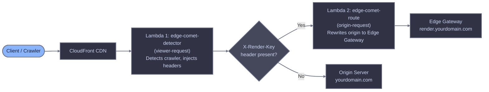
```mermaid
flowchart LR
    classDef entry fill:#89B4FA,stroke:#6C7086,stroke-width:2px,color:#1E1E2E;
    classDef process fill:#313244,stroke:#6C7086,stroke-width:2px,color:#CDD6F4;
    classDef decision fill:#45475A,stroke:#6C7086,stroke-width:2px,color:#CDD6F4;

    Client([Client / Crawler])
    CF[CloudFront CDN]
    Detector["Lambda 1: edge-comet-detector\n(viewer-request)\nDetects crawler, injects headers"]
    IsCrawler{X-Render-Key\nheader present?}
    Router["Lambda 2: edge-comet-route\n(origin-request)\nRewrites origin to Edge Gateway"]
    EG[Edge Gateway\nrender.yourdomain.com]
    Origin[Origin Server\nyourdomain.com]

    Client --> CF
    CF --> Detector
    Detector --> IsCrawler
    IsCrawler -- Yes --> Router
    IsCrawler -- No --> Origin
    Router --> EG

    class Client entry;
    class CF,Detector,Router,EG,Origin process;
    class IsCrawler decision;

    linkStyle default stroke:#6C7086,stroke-width:2px;
```

**Why two functions instead of one?**

The viewer-request event can read and modify request headers but cannot rewrite the origin. The origin-request event can rewrite the origin but cannot read the original `User-Agent` without the header forwarding trick below. Splitting across two events solves both constraints:

- **`edge-comet-detector`** runs on `viewer-request`: reads the `User-Agent`, and if it matches a crawler, injects `X-Render-Key` and `X-Render-Host` headers into the request
- **`edge-comet-route`** runs on `origin-request`: checks for `X-Render-Key` and, if found, rewrites the request origin to Edge Gateway

The injected headers act as a signal between the two functions. CloudFront forwards them from the viewer-request stage to origin-request via Legacy cache settings (see [step 7.2](#_7-2-cache-behavior-legacy-cache-settings)).

**Request flow — crawler (e.g. Googlebot)**

1. Googlebot sends a request to `aws.yourdomain.com`
2. CloudFront triggers the `viewer-request` Lambda
3. `edge-comet-detector` detects the Googlebot User-Agent
4. Injects `X-Render-Key` and `X-Render-Host` headers into the request
5. CloudFront forwards these headers to the origin-request stage via Legacy cache settings
6. `edge-comet-route` fires, detects `X-Render-Key`, rewrites the origin to `render.yourdomain.com`
7. Edge Gateway renders the page with headless Chrome
8. Returns fully rendered HTML to Googlebot
9. CloudFront caches the rendered response

**Request flow — regular user**

1. Browser sends a request to `aws.yourdomain.com`
2. CloudFront checks cache — if hit, serves immediately
3. `viewer-request` Lambda fires — User-Agent is not a crawler, no headers injected
4. `origin-request` Lambda fires — no `X-Render-Key` found, passes through unchanged
5. Request goes to `yourdomain.com` origin, returns normal HTML

## DNS configuration

Create the following DNS records pointing to your EC2 instance's public IP:

| Subdomain | Purpose |
|-----------|---------|
| `render.yourdomain.com` | Edge Gateway endpoint (Nginx reverse proxy to port 10070) |
| `aws.yourdomain.com` | CloudFront distribution CNAME alias |
| `yourdomain.com` | Main site origin |

> Replace `yourdomain.com` with your actual domain throughout this guide.

## 1. Deploy EdgeComet Engine

### 1.1 Clone and configure

SSH into your EC2 instance and clone the engine repository:

```bash
git clone https://github.com/EdgeComet/engine
cd engine
```

Create your host configuration file:

```bash
nano configs/docker/hosts.d/01-mysite.yaml
```

Add the following content:

```yaml
hosts:
  - id: 1
    domain: "aws.yourdomain.com"
    render_key: "your-render-key-here"
    enabled: true
    render:
      timeout: 45s
```

Generate a secure render key:

```bash
openssl rand -hex 16
```

### 1.2 Build and start

```bash
docker compose build
docker compose up -d
docker compose ps   # All services should show 'healthy'
```

### 1.3 Test the engine locally

```bash
curl -i \
  -H "X-Render-Key: your-render-key-here" \
  -H "User-Agent: Mozilla/5.0 (compatible; Googlebot/2.1)" \
  "http://localhost:10070/render?url=https://yourdomain.com/"
```

Expected response header: `X-Render-Source: rendered`

## 2. Nginx reverse proxy + SSL

### 2.1 Install dependencies

```bash
apt update
apt install nginx certbot python3-certbot-nginx -y
```

### 2.2 SSL certificates

```bash
certbot --nginx -d render.yourdomain.com
certbot --nginx -d yourdomain.com -d www.yourdomain.com -d aws.yourdomain.com
```

### 2.3 Nginx configuration for the render engine

Create `/etc/nginx/sites-available/edgecomet`:

```nginx
server {
    server_name render.yourdomain.com;

    location / {
        proxy_pass http://localhost:10070;
        proxy_set_header Host $host;
        proxy_set_header X-Forwarded-For $remote_addr;
        proxy_set_header X-Forwarded-Proto https;
        proxy_set_header X-Render-Key $http_x_render_key;
        proxy_read_timeout 60s;
    }

    listen 443 ssl;
    ssl_certificate /etc/letsencrypt/live/render.yourdomain.com/fullchain.pem;
    ssl_certificate_key /etc/letsencrypt/live/render.yourdomain.com/privkey.pem;
    include /etc/letsencrypt/options-ssl-nginx.conf;
}
```

### 2.4 Nginx configuration for the origin site

Create `/etc/nginx/sites-available/mysite`:

```nginx
server {
    server_name yourdomain.com www.yourdomain.com aws.yourdomain.com;

    root /var/www/html;
    index index.html;

    location / {
        try_files $uri $uri/ /index.html;
    }

    listen 80;
    listen 443 ssl;
    ssl_certificate /etc/letsencrypt/live/yourdomain.com/fullchain.pem;
    ssl_certificate_key /etc/letsencrypt/live/yourdomain.com/privkey.pem;
    include /etc/letsencrypt/options-ssl-nginx.conf;
}
```

Enable both sites and reload:

```bash
ln -s /etc/nginx/sites-available/edgecomet /etc/nginx/sites-enabled/
ln -s /etc/nginx/sites-available/mysite /etc/nginx/sites-enabled/
nginx -t && systemctl reload nginx
```

### 2.5 Test the render endpoint over HTTPS

```bash
curl -i \
  -H "X-Render-Key: your-render-key-here" \
  -H "User-Agent: Mozilla/5.0 (compatible; Googlebot/2.1)" \
  "https://render.yourdomain.com/render?url=https://yourdomain.com/"
```

Expected:

```
HTTP/1.1 200 OK
X-Render-Source: rendered
X-Render-Service: rs-1
```

Do not proceed until this test passes. If you see an SSL handshake error, confirm the certificate was issued for `render.yourdomain.com` and that Nginx has been reloaded.

## 3. ACM certificate for CloudFront

::: warning ACM region requirement
ACM certificates used with CloudFront must be created in **us-east-1** (N. Virginia). CloudFront cannot use certificates from any other region. Confirm the region selector shows N. Virginia before proceeding.
:::

1. Open [AWS Certificate Manager](https://console.aws.amazon.com/acm/home?region=us-east-1), click **Request a certificate**, select **Request a public certificate** and click **Next**

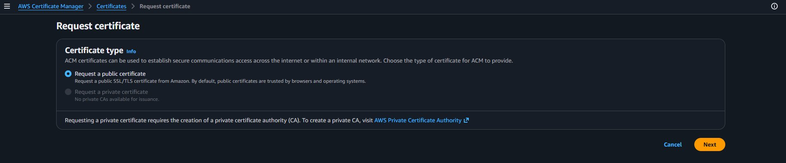

2. Under **Fully qualified domain name**, add two entries — a wildcard to cover all subdomains and your specific `aws` subdomain:
   - `*.yourdomain.com`
   - `aws.yourdomain.com`

   Set validation method to **DNS validation** and click **Request**

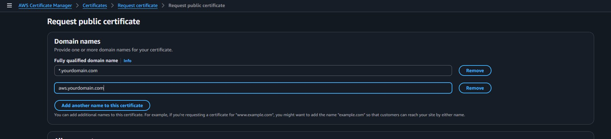

::: tip Use a wildcard certificate
Adding `*.yourdomain.com` alongside `aws.yourdomain.com` means the same certificate covers any future subdomains — you won't need to re-issue it later.
:::

3. Copy the CNAME name and value shown under **Domains** and add the record in your DNS provider. Wait for the status to change to **Issued** (5–30 minutes)

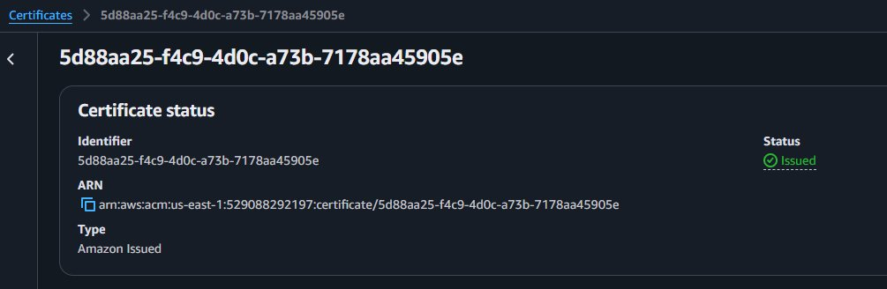

::: tip
Do not proceed to the next step until the certificate status shows **Issued**. CloudFront will not let you select a pending certificate.
:::

## 4. IAM role for Lambda@Edge

Create a single IAM role that both Lambda functions share. Both `lambda.amazonaws.com` and `edgelambda.amazonaws.com` must be in the trust policy — without `edgelambda.amazonaws.com`, CloudFront cannot execute the functions and returns a `503 LambdaExecutionError`.

```bash
aws iam create-role \
  --role-name edge-comet-lambda-edge-role \
  --assume-role-policy-document '{
    "Version": "2012-10-17",
    "Statement": [{
      "Effect": "Allow",
      "Principal": {
        "Service": ["edgelambda.amazonaws.com", "lambda.amazonaws.com"]
      },
      "Action": "sts:AssumeRole"
    }]
  }'

aws iam attach-role-policy \
  --role-name edge-comet-lambda-edge-role \
  --policy-arn arn:aws:iam::aws:policy/service-role/AWSLambdaBasicExecutionRole
```

If you prefer the console, create the role in IAM then click the **Trust relationships** tab and edit the policy to match the JSON above — both service principals must be present.

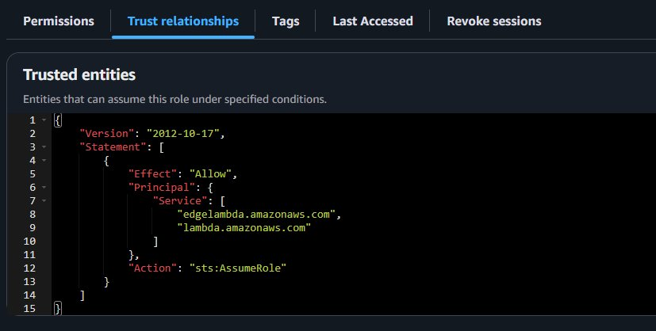

## 5. Lambda function 1 — Crawler detector

This function runs on the **viewer-request** event. It detects crawlers by User-Agent and injects `X-Render-Key` and `X-Render-Host` headers into the request so the origin-request function can act on them.

::: warning us-east-1 required
Switch the Lambda console region to **us-east-1** (N. Virginia) before creating either function. Lambda@Edge functions created in any other region cannot be associated with CloudFront.
:::

### 5.1 Create the function

1. Open the [Lambda console](https://console.aws.amazon.com/lambda/) — confirm region is **us-east-1**
2. Click **Create function** → **Author from scratch** and fill in:
   - **Function name**: `edge-comet-detector`
   - **Runtime**: `Node.js 20.x`
   - **Architecture**: `x86_64`
   - **Execution role**: Use an existing role → `edge-comet-lambda-edge-role`
3. Click **Create function**

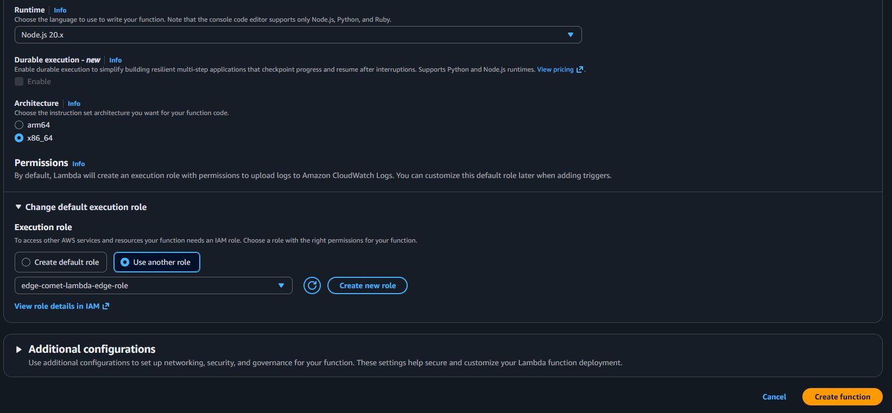

### 5.2 Function code

Replace the default code in `index.js` with:

```javascript
'use strict';

const CONFIG = {
  RENDER_KEY: "your-render-key-here",
};

const CRAWLER_PATTERN = /bot|crawl|spider|slurp|WhatsApp|Snapchat|facebookexternalhit|AMZN-User|Claude-User|Perplexity-User|ChatGPT-User/i;

const STATIC_EXTENSIONS = /\.(avif|css|eot|gif|gz|ico|jpeg|jpg|js|json|map|mp3|mp4|ogg|otf|pdf|png|svg|ttf|txt|wasm|wav|webm|webp|woff|woff2|xml|zip)$/i;

exports.handler = (event, context, callback) => {
  const request = event.Records[0].cf.request;
  const headers = request.headers;
  const userAgent = headers['user-agent']
    ? headers['user-agent'][0].value : '';

  if (!STATIC_EXTENSIONS.test(request.uri) && CRAWLER_PATTERN.test(userAgent)) {
    headers['x-render-key'] = [{
      key: 'X-Render-Key', value: CONFIG.RENDER_KEY
    }];
    headers['x-render-host'] = [{
      key: 'X-Render-Host', value: headers['host'][0].value
    }];
  }

  callback(null, request);
};
```

Set `RENDER_KEY` to the key in your host configuration.

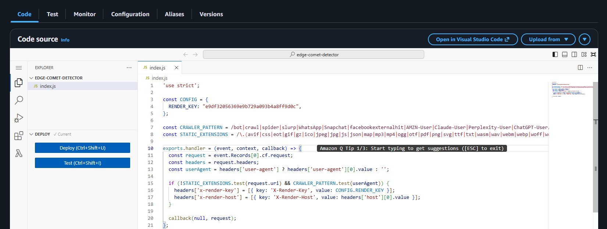

### 5.3 Deploy and publish

1. Click **Deploy**
2. Click **Actions** → **Publish new version** → leave description blank → **Publish**
3. Copy the full version ARN — it ends with `:1`:

```
arn:aws:lambda:us-east-1:YOUR_ACCOUNT_ID:function:edge-comet-detector:1
```

::: warning Published version required
Lambda@Edge cannot use `$LATEST`. Always publish a numbered version and use that ARN when associating with CloudFront.
:::

## 6. Lambda function 2 — Origin router

This function runs on the **origin-request** event. It checks for `X-Render-Key`. If found, it rewrites the request origin to the EdgeComet render engine and rewrites the path to `/render?url=<original-url>`.

### 6.1 Create the function

1. In the Lambda console (still **us-east-1**), click **Create function** → **Author from scratch**:
   - **Function name**: `edge-comet-route`
   - **Runtime**: `Node.js 20.x`
   - **Architecture**: `x86_64`
   - **Execution role**: Use an existing role → `edge-comet-lambda-edge-role`
2. Click **Create function**

### 6.2 Function code

Replace the default code in `index.js` with:

```javascript
'use strict';

const CONFIG = {
  // Bare hostname only — no https://, no trailing slash
  EDGE_COMET_HOST: "render.yourdomain.com",
};

exports.handler = (event, context, callback) => {
  const request = event.Records[0].cf.request;
  const headers = request.headers;

  if (headers['x-render-key'] && headers['x-render-host']) {
    const proto = headers['cloudfront-forwarded-proto']
      ? headers['cloudfront-forwarded-proto'][0].value : 'https';
    const host = headers['x-render-host'][0].value;
    const qs = request.querystring ? '?' + request.querystring : '';
    const originalUrl = `${proto}://${host}${request.uri}${qs}`;

    request.origin = {
      custom: {
        domainName: CONFIG.EDGE_COMET_HOST,
        port: 443,
        protocol: 'https',
        sslProtocols: ['TLSv1.2'],
        path: '',
        readTimeout: 60,
        keepaliveTimeout: 60,
      },
    };

    request.uri = '/render';
    request.querystring = `url=${encodeURIComponent(originalUrl)}`;

    headers['host'] = [{
      key: 'Host', value: CONFIG.EDGE_COMET_HOST
    }];
  }

  callback(null, request);
};
```

Set `EDGE_COMET_HOST` to your render engine hostname (e.g. `render.yourdomain.com`).

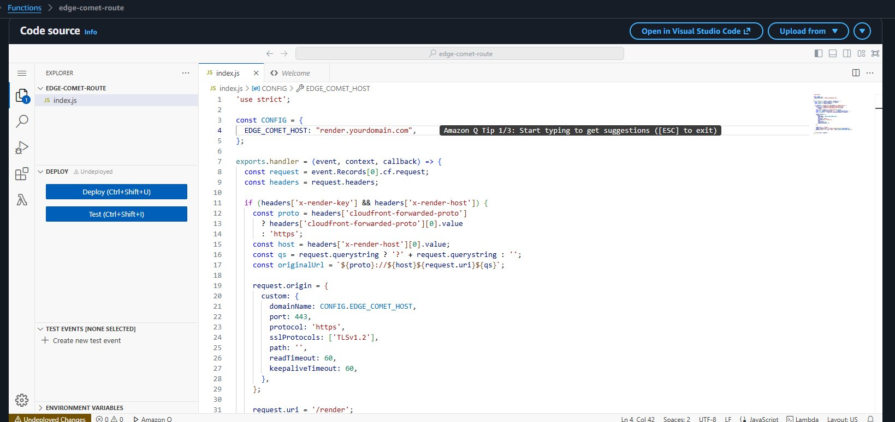

::: warning EDGE_COMET_HOST format
Bare hostname only — no `https://` prefix, no trailing slash. The origin object handles the protocol. Getting this wrong causes immediate 502 errors.
:::

::: warning Blacklisted headers at origin-request
Do not set `x-forwarded-for` or `x-forwarded-proto` in this function. CloudFront treats these as blacklisted headers at the origin-request stage and returns a `502 LambdaValidationError`.
:::

### 6.3 Deploy and publish

1. Click **Deploy**
2. Click **Actions** → **Publish new version** → **Publish**
3. Copy the version ARN:

```
arn:aws:lambda:us-east-1:YOUR_ACCOUNT_ID:function:edge-comet-route:1
```

## 7. CloudFront distribution

### 7.1 Create the distribution

Go to [CloudFront](https://console.aws.amazon.com/cloudfront/) → **Create distribution**.

When prompted for a pricing plan, select **Pay as you go** — this gives you full control over feature selection and custom rates, and is the correct choice for this setup.

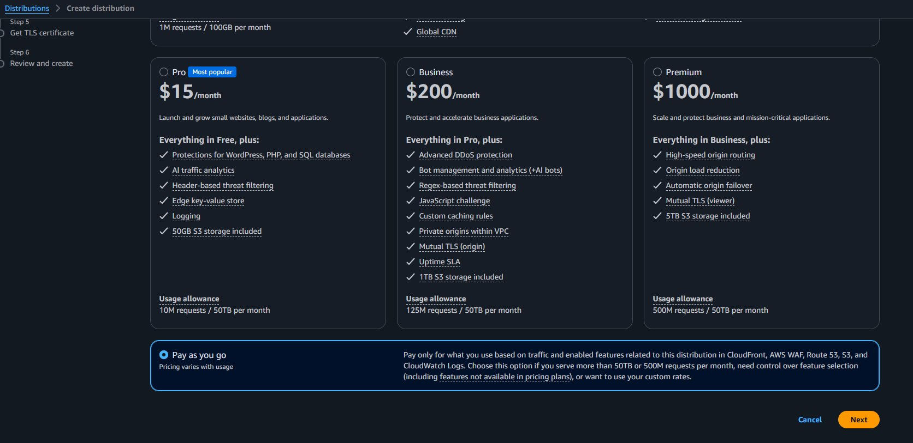

Configure the **Origin** section:

| Setting | Value |
|---------|-------|
| **Origin domain** | `yourdomain.com` |
| **Origin protocol policy** | HTTP only (port 80) |
| **Origin response timeout** | `60` seconds |

::: warning Origin protocol policy
Set to **HTTP only**. If you see 502 Bad Gateway errors from origin, this is the first setting to check.
:::

::: warning Origin response timeout
Increase from the default 30 seconds to at least 60. This must be higher than your Edge Gateway `render.timeout` or CloudFront will 504 while the engine is still rendering.
:::

Configure the **Settings** section:

| Setting | Value |
|---------|-------|
| **Alternate domain names (CNAMEs)** | `aws.yourdomain.com`, `yourdomain.com` |
| **Custom SSL certificate** | Select the wildcard certificate issued in step 3 |
| **Price class** | Use all edge locations (best performance) |

After creating the distribution, the **General** tab confirms the settings — alternate domain names, wildcard SSL certificate, and security policy TLSv1.2_2021.

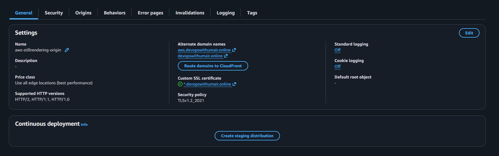

### 7.2 Cache behavior — Legacy cache settings

::: warning Use Legacy cache settings, not a managed origin request policy
This is the step that makes the two-function architecture work. CloudFront strips custom `X-` headers when using managed cache/origin request policies. **Legacy cache settings** is what allows `X-Render-Key` and `X-Render-Host` — injected by the viewer-request Lambda — to survive through to the origin-request Lambda.
:::

In the distribution's **Behaviors** tab, edit the default behavior. Under **Cache key and origin requests**, select **Legacy cache settings** and configure:

| Setting | Value |
|---------|-------|
| **Headers** | Include the following headers |
| **Header list** | `CloudFront-Forwarded-Proto`, `User-Agent`, `X-Render-Host`, `X-Render-Key` |
| **Query strings** | None |
| **Cookies** | None |
| **Object caching** | Use origin cache headers |

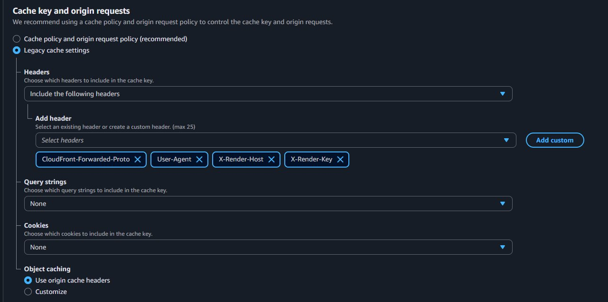

### 7.3 Lambda function associations

In the same behavior edit screen, under **Function associations**, add both functions:

| Event type | Function type | ARN |
|------------|--------------|-----|
| **Viewer request** | Lambda@Edge | `arn:aws:lambda:us-east-1:YOUR_ACCOUNT_ID:function:edge-comet-detector:1` |
| **Viewer response** | No association | — |
| **Origin request** | Lambda@Edge | `arn:aws:lambda:us-east-1:YOUR_ACCOUNT_ID:function:edge-comet-route:1` |
| **Origin response** | No association | — |

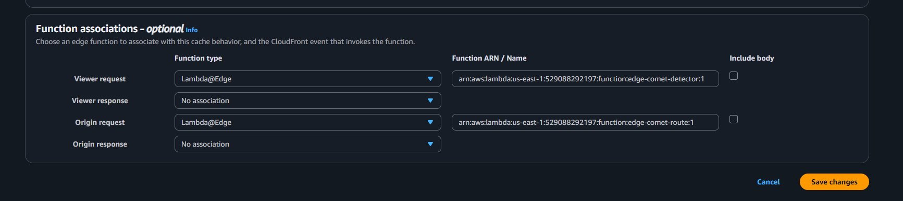

::: warning Use versioned ARNs
Always use ARNs ending in `:1`, `:2`, etc. Never use `$LATEST` — CloudFront will reject it.
:::

Click **Save changes** and wait for the distribution status to show **Deployed** (5–10 minutes).

## 8. DNS — point aws subdomain at CloudFront

Copy your distribution's **Domain name** from the CloudFront General tab (e.g. `d1abc2defgh3ij.cloudfront.net`) and add a CNAME record in your DNS provider:

| Field | Value |
|-------|-------|
| **Type** | CNAME |
| **Name** | `aws` |
| **Value** | `d1abc2defgh3ij.cloudfront.net` |
| **TTL** | 300 |

## 9. Verification

### Test crawler request

```bash
curl -v \
  -H "User-Agent: Mozilla/5.0 (compatible; Googlebot/2.1)" \
  "https://aws.yourdomain.com/"
```

Expected response headers:

```
HTTP/1.1 200 OK
X-Render-Source: rendered
X-Render-Service: rs-1
X-Render-Cache: new
```

A second request to the same URL should return `X-Render-Source: cache`.

### Test regular user request

```bash
curl -I \
  -H "User-Agent: Mozilla/5.0 (Macintosh; Intel Mac OS X 10_15_7) AppleWebKit/537.36" \
  "https://aws.yourdomain.com/"
```

Expected: `200 OK` with no `X-Render-*` headers — regular users bypass EdgeComet entirely.

### Visual verification

Use [jsbug.org](https://jsbug.org) to visually confirm rendering:

1. Enter your CloudFront URL
2. Select **Googlebot** as the User-Agent and click **Analyze**
3. The **JS Rendered** panel should show all dynamic content populated
4. The **Non JS** panel shows empty placeholders

## Updating Lambda functions

After updating either function's code:

1. Click **Deploy** in the Lambda console
2. Click **Actions** → **Publish new version**
3. Update the CloudFront behavior's function association with the new version ARN
4. Wait for the distribution to deploy (5–15 minutes)

You cannot delete a Lambda@Edge version while any CloudFront distribution references it. Wait for full deployment before deleting old versions.

## Troubleshooting

### 503 LambdaExecutionError

The IAM role trust policy is missing `edgelambda.amazonaws.com`. Edit the **Trust relationships** for `edge-comet-lambda-edge-role` and ensure both `edgelambda.amazonaws.com` and `lambda.amazonaws.com` are present.

### 502 LambdaValidationError: blacklisted header

The origin-request Lambda (`edge-comet-route`) is setting `x-forwarded-for` or `x-forwarded-proto`. These headers are blacklisted at the origin-request stage. Remove them from the router function.

### 401 — X-Render-Key header required

`X-Render-Key` is not reaching the origin-request Lambda. Verify `X-Render-Key` is listed in the Legacy cache settings forwarded headers. Without it, CloudFront strips the header between the viewer-request and origin-request stages.

### 401 — Invalid render key or domain mismatch

The `domain` in your host configuration must exactly match the host in the URL being rendered. If the engine receives `https://aws.yourdomain.com/page` but the config has `domain: "yourdomain.com"`, it rejects the request.

### 502 Bad Gateway from origin

The origin protocol policy is mismatched. Change the **Origin protocol policy** to **HTTP only** in the CloudFront origin settings.

### Regular users receiving rendered HTML

The `CRAWLER_PATTERN` regex in `edge-comet-detector` is matching regular browser User-Agents. Review the pattern and verify it does not match standard desktop or mobile browsers.

### X-Cache: Miss on every request

The cache key is inconsistent between requests. Verify the Legacy cache settings header list does not include headers that vary per-request.

### Lambda@Edge logs not appearing in us-east-1

Lambda@Edge logs appear in CloudWatch in the AWS region closest to the viewer, not in us-east-1. Log group names follow the pattern:

```
/aws/lambda/us-east-1.edge-comet-detector
/aws/lambda/us-east-1.edge-comet-route
```

### SSL/TLS errors connecting to the render engine

Test with `curl -k https://render.yourdomain.com/render?url=https://yourdomain.com/`. If `-k` (skip certificate verification) works but normal curl does not, the certificate is self-signed or issued for a different hostname. Reissue with certbot for the correct domain.

## Lambda@Edge constraints

| Constraint | Value | Impact |
|------------|-------|--------|
| Deployment region | us-east-1 only | Both functions must be created in N. Virginia |
| Environment variables | Not supported | All configuration embedded in code |
| Published version required | Cannot use `$LATEST` | Publish after every code change |
| viewer-request timeout | 5 seconds | Header injection only — no HTTP calls here |
| origin-request timeout | 30 seconds | Sufficient for origin rewriting |
| Blacklisted headers at origin-request | `x-forwarded-for`, `x-forwarded-proto` | Do not set these in the router function |
| CloudWatch Logs region | Viewer's nearest region | Logs are not in us-east-1 |
| Deployment propagation | 5–15 minutes | Distribution updates propagate globally |

## Related documentation

- [CloudFront reference](./cloudfront-reference) - Detailed code explanations
- [Diagnostic headers](/edge-gateway/x-headers) - Response header reference
- [Dimensions](/edge-gateway/dimensions) - Crawler detection via User-Agent matching
- [Caching](/edge-gateway/caching) - Cache configuration
- [Cloudflare Worker integration](./cloudflare-worker) - Alternative integration method
