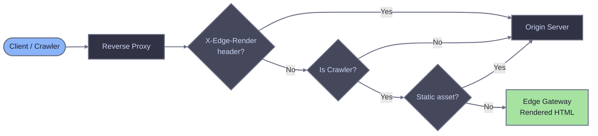

# Custom integration

Use this guide to implement an EdgeComet integration on any reverse proxy or edge platform. It describes the universal traffic routing flow, the checks your proxy must perform, and the headers it must send.

If you use one of the platforms below, follow its dedicated guide instead:

- [nginx](./nginx)
- [Cloudflare Worker](./cloudflare-worker)
- [Fastly CDN](./fastly)
- [AWS CloudFront](./cloudfront)
- [HAProxy](./haproxy)

## Prerequisites

- Running Edge Gateway instance (see [Quick Start](/quick-start))
- Configured host with `render_key` and `domain`

## How it works

Search engine crawlers and AI bots cannot execute JavaScript. Pages that rely on client-side rendering appear empty or broken to them. EdgeComet solves this by sitting between the reverse proxy and the origin, rendering pages with a headless browser and returning the final HTML.

When a crawler requests a page, the proxy routes the request to Edge Gateway, which returns pre-rendered HTML. Regular users go directly to origin.

The proxy runs three checks on each incoming request, in order:

1. **Loop prevention** - Does the request carry an `X-Edge-Render` header? If yes, skip rendering and send directly to origin.
2. **Crawler detection** - Is the User-Agent a known crawler? If no, send to origin.
3. **Static asset check** - Is the request for a static file? If yes, send to origin.

If the request passes all three checks, route it to Edge Gateway.



## Loop prevention

When Edge Gateway renders a page, the Render Service fetches the page from your origin through the same reverse proxy. Without a safeguard, this creates an infinite loop: proxy routes to EG, EG fetches from origin through the proxy, the proxy routes back to EG, and so on.

The Render Service adds an `X-Edge-Render` header to its outgoing requests. Your proxy must check for this header early in request processing, before crawler detection. If the header is present, send the request directly to origin and skip all rendering logic.

## Crawler detection

Identify crawlers by matching the `User-Agent` header against known patterns. Use case-insensitive matching.

Start with four generic keywords that cover most search engine crawlers:

- `bot`
- `crawl`
- `spider`
- `slurp`

Some crawlers do not include these keywords in their User-Agent string. Add explicit patterns for them:

- `WhatsApp`
- `Snapchat`
- `facebookexternalhit`
- `AMZN-User`
- `Claude-User`
- `Perplexity-User`
- `ChatGPT-User`

A request matches if the User-Agent contains any one of these strings. This broad approach catches the majority of crawlers while keeping the detection logic simple.

## Static asset exclusion

Skip rendering for requests to static files. Match the URL path against common static file extensions:

`.avif`, `.css`, `.eot`, `.gif`, `.gz`, `.ico`, `.jpeg`, `.jpg`, `.js`, `.json`, `.map`, `.mp3`, `.mp4`, `.ogg`, `.otf`, `.pdf`, `.png`, `.svg`, `.ttf`, `.txt`, `.wasm`, `.wav`, `.webm`, `.webp`, `.woff`, `.woff2`, `.xml`, `.zip`

Run this check after crawler detection. If the request is from a crawler but targets a static file, send it directly to origin.

## Routing to Edge Gateway

Send matching requests to the Edge Gateway render endpoint:

```
GET /render?url=<encoded-url>
```

The `url` parameter is the full original URL (scheme, host, path, and query string), URL-encoded. For example, a request for `https://example.com/blog/post?id=42` becomes:

```
GET /render?url=https%3A%2F%2Fexample.com%2Fblog%2Fpost%3Fid%3D42
```

Forward the response from Edge Gateway back to the client as-is, including the response body and headers.

## Required headers

Send these headers with each request to Edge Gateway:

| Header | Required | Description |
|---|---|---|
| `X-Render-Key` | Yes | Authentication token from your host configuration. |
| `User-Agent` | Yes | Original crawler User-Agent, passed through unchanged. Edge Gateway uses this for dimension matching. |
| `X-Forwarded-For` | Recommended | Original client IP address. |
| `X-Forwarded-Proto` | Recommended | Original request protocol (`http` or `https`). |
| `X-Request-ID` | Optional | Request tracing identifier. Edge Gateway generates one automatically if absent. |

## Error handling

Implement fail-open behavior. If Edge Gateway is unreachable or returns a 5xx error, fall back to your origin server. The crawler receives unrendered content, but the page remains accessible. Never return an error page to a crawler because Edge Gateway is down.

Return 4xx responses from Edge Gateway to the client as-is. These are legitimate errors (authentication failure, missing host configuration) and should not trigger a fallback to origin.

## Timeout considerations

Set the proxy timeout for the Edge Gateway upstream higher than Edge Gateway's own render timeout. If Edge Gateway is configured with a 30-second render timeout, set the proxy timeout to at least 35-60 seconds.

A proxy timeout that is too low cuts the connection while Edge Gateway is still rendering, causing the request to fail even though a valid response is on the way.

## Verification

Replace `example.com` in the commands below with your domain.

### Test crawler routing

Send a request with a crawler User-Agent:

```bash
curl -v \
  -H "User-Agent: Mozilla/5.0 (compatible; Googlebot/2.1; +http://www.google.com/bot.html)" \
  "http://example.com/"
```

Check the response headers:
- `X-Render-Source: rendered` or `X-Render-Source: cache` confirms Edge Gateway processed the request.

### Test regular user routing

Send a request with a browser User-Agent:

```bash
curl -v \
  -H "User-Agent: Mozilla/5.0 (Macintosh; Intel Mac OS X 10_15_7) AppleWebKit/537.36" \
  "http://example.com/"
```

The request should go directly to origin with no `X-Render-*` headers in the response.

### Test with jsbug

Use [jsbug.org](https://jsbug.org) to verify that crawlers receive rendered content:

1. Enter your page URL
2. Click the settings icon and select **Googlebot** as the User-Agent
3. Click **Analyze**

The **JS Rendered** panel shows what Edge Gateway returns to crawlers. Compare it with the **Non JS** panel to confirm JavaScript content is being rendered.

## Related documentation

- [Diagnostic headers](/edge-gateway/x-headers) - Response header reference
- [Dimensions](/edge-gateway/dimensions) - Crawler detection via User-Agent matching
- [Caching](/edge-gateway/caching) - Cache configuration
- [Bypass mode](/edge-gateway/bypass-mode) - Direct origin fetching
