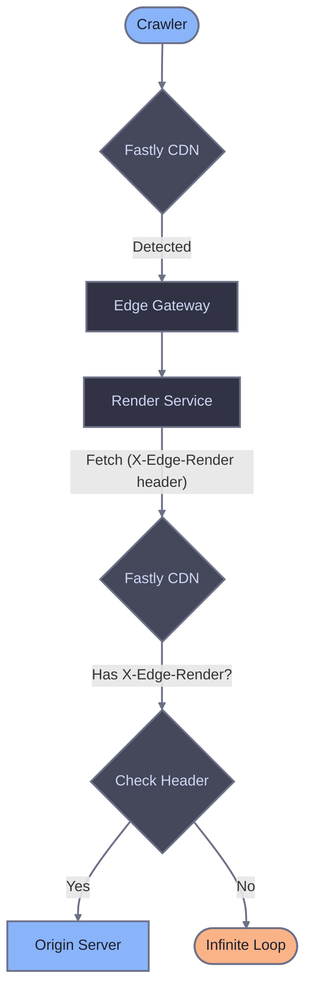

# Fastly reference

This page provides detailed explanations of Fastly VCL configuration components. For installation and setup, see the [main Fastly guide](./fastly).

## Crawler detection approaches

Both approaches route only crawler traffic to Edge Gateway. Regular users always go directly to origin. The difference is how crawlers are identified:

| Approach | Description | Use when |
|----------|-------------|----------|
| Broad (default) | Generic keywords (bot, crawl, spider) + explicit patterns | You want to catch more crawlers including unknown ones |
| Conservative | Explicit list of known crawlers | You want predictable behavior with no false positives |

### Broad detection (default)

Catches crawlers using generic keywords plus explicit patterns for crawlers without these keywords in their name.

```vcl
# Generic crawler keywords
if (req.http.User-Agent ~ "(?i)(bot|crawl|spider|slurp)") {
    set var.is_crawler = true;
}

# Crawlers without generic keywords in name
if (req.http.User-Agent ~ "(?i)(WhatsApp|Snapchat|facebookexternalhit|AMZN-User|Claude-User|Perplexity-User|ChatGPT-User)") {
    set var.is_crawler = true;
}
```

### Conservative detection

Explicit patterns for known search engines, AI crawlers, social media, and messengers based on [bot aliases](/edge-gateway/dimensions#available-aliases).

To use this approach, replace the crawler detection block in the recv snippet:

```vcl
declare local var.is_crawler BOOL;
set var.is_crawler = false;

# Search engines ($SearchBots alias)
if (req.http.User-Agent ~ "(?i)Googlebot") { set var.is_crawler = true; }
if (req.http.User-Agent ~ "(?i)bingbot") { set var.is_crawler = true; }

# AI crawlers ($AIBots alias)
if (req.http.User-Agent ~ "(?i)ChatGPT-User") { set var.is_crawler = true; }
if (req.http.User-Agent ~ "(?i)GPTBot") { set var.is_crawler = true; }
if (req.http.User-Agent ~ "(?i)OAI-SearchBot") { set var.is_crawler = true; }
if (req.http.User-Agent ~ "(?i)PerplexityBot") { set var.is_crawler = true; }
if (req.http.User-Agent ~ "(?i)Perplexity-User") { set var.is_crawler = true; }
if (req.http.User-Agent ~ "(?i)ClaudeBot") { set var.is_crawler = true; }
if (req.http.User-Agent ~ "(?i)Claude-User") { set var.is_crawler = true; }
if (req.http.User-Agent ~ "(?i)Claude-SearchBot") { set var.is_crawler = true; }
if (req.http.User-Agent ~ "(?i)Amazonbot") { set var.is_crawler = true; }
if (req.http.User-Agent ~ "(?i)AMZN-User") { set var.is_crawler = true; }

# Google Ads bots
if (req.http.User-Agent ~ "(?i)AdsBot-Google") { set var.is_crawler = true; }
if (req.http.User-Agent ~ "(?i)AdsBot-Google-Mobile") { set var.is_crawler = true; }

# Social media ($Socials alias)
if (req.http.User-Agent ~ "(?i)facebookexternalhit") { set var.is_crawler = true; }
if (req.http.User-Agent ~ "(?i)twitterbot") { set var.is_crawler = true; }
if (req.http.User-Agent ~ "(?i)Pinterestbot") { set var.is_crawler = true; }
if (req.http.User-Agent ~ "(?i)Applebot") { set var.is_crawler = true; }
if (req.http.User-Agent ~ "(?i)LinkedInBot") { set var.is_crawler = true; }

# Messengers ($Messengers alias)
if (req.http.User-Agent ~ "(?i)WhatsApp") { set var.is_crawler = true; }
if (req.http.User-Agent ~ "(?i)Telegrambot") { set var.is_crawler = true; }
if (req.http.User-Agent ~ "(?i)ViberBot") { set var.is_crawler = true; }
if (req.http.User-Agent ~ "(?i)Snapchat") { set var.is_crawler = true; }
if (req.http.User-Agent ~ "(?i)Discordbot") { set var.is_crawler = true; }
if (req.http.User-Agent ~ "(?i)Slackbot") { set var.is_crawler = true; }
```

## Static asset detection

The recv snippet skips rendering for static files to avoid unnecessary requests to Edge Gateway:

```vcl
if (req.url.ext ~ "(?i)^(avif|css|eot|gif|gz|ico|jpeg|jpg|js|json|map|mp3|mp4|ogg|otf|pdf|png|svg|ttf|txt|wasm|wav|webm|webp|woff|woff2|xml|zip)$") {
    return(pass);
}
```

Fastly extracts the file extension from the URL into `req.url.ext`, making extension checks straightforward. This saves a round-trip to Edge Gateway for requests that never need rendering.

## Loop prevention

When Edge Gateway renders a page, the Render Service fetches the target URL from your origin server. Without loop prevention, Fastly would detect the Render Service request as a crawler and route it back to Edge Gateway, creating an infinite loop.

The Render Service adds an `X-Edge-Render` header to all outgoing requests. The recv snippet detects this header and passes the request directly to origin:

```vcl
if (req.http.X-Edge-Render) {
    return(pass);
}
```



## Error handling (fail-open)

The VCL configuration uses Fastly's `restart` mechanism to implement fail-open behavior. If Edge Gateway returns a server error, the request restarts and goes to origin instead:

```vcl
# In vcl_backend_error or vcl_error
if (req.restarts == 0 && beresp.status >= 500 && req.backend == edge_comet) {
    restart;
}
```

On restart, the recv snippet detects `req.restarts > 0` and skips the Edge Gateway routing:

```vcl
# Top of vcl_recv
if (req.restarts > 0) {
    return(pass);
}
```

This ensures crawlers receive content even if Edge Gateway is temporarily unavailable. They get unrendered JavaScript content rather than an error page.

## Fastly-level caching (optional)

The default configuration uses `return(pass)` for crawler requests, which bypasses Fastly's cache. Edge Gateway manages its own caching layer, so this works well for most setups.

For high-traffic sites, you can enable Fastly-level caching to reduce round-trips to Edge Gateway on repeat crawler visits. This requires two changes:

### 1. Allow caching in vcl_recv

Remove `return(pass)` from the crawler routing block and replace it with `return(lookup)` to let Fastly cache Edge Gateway responses:

```vcl
if (var.is_crawler) {
    set req.backend = edge_comet;
    set req.http.X-Render-Key = "your_render_key_here";
    set req.http.X-Forwarded-Proto = if(req.is_ssl, "https", "http");
    set req.http.X-Forwarded-For = client.ip;
    set req.url = "/render?url=" + urlencode(if(req.is_ssl, "https", "http") + "://" + req.http.Host + req.url);

    return(lookup);
}
```

### 2. Add User-Agent to cache key

Without this change, Fastly could serve cached rendered HTML to regular users. Add a `vcl_hash` snippet that includes the User-Agent in the cache key for crawler requests:

```vcl
# In vcl_hash
if (req.backend == edge_comet) {
    set req.hash += req.http.User-Agent;
}
```

When using Fastly-level caching, configure appropriate TTLs in `vcl_backend_response` to control how long rendered content stays in Fastly's cache. Edge Gateway sets `Cache-Control` headers on its responses that Fastly respects by default.

### Alternative: configure cache key via UI

Instead of writing a `vcl_hash` snippet, you can modify the cache key through the Fastly management console:

1. Navigate to **Settings** > **Cache settings**


2. Create a cache setting and set **Cache keys** to `req.url, req.http.host, req.http.User-Agent`


This achieves the same result as the `vcl_hash` snippet without writing VCL code.

## Headers reference

### Headers sent to Edge Gateway

| Header | Description |
|--------|-------------|
| `X-Render-Key` | Authentication token from host configuration. |
| `User-Agent` | Original client User-Agent for dimension matching. Fastly preserves this by default. |
| `X-Forwarded-For` | Original client IP address (`client.ip`). |
| `X-Forwarded-Proto` | Original request protocol (http/https). |

## Backend configuration reference

| Setting | Value | Description |
|---------|-------|-------------|
| `.host` | Your EG hostname | Edge Gateway hostname (e.g., `render.example.com`). |
| `.port` | `"443"` | HTTPS port. |
| `.ssl` | `true` | Enable TLS for the backend connection. |
| `.ssl_sni_hostname` | Same as `.host` | Server Name Indication hostname for TLS handshake. |
| `.ssl_cert_hostname` | Same as `.host` | Expected hostname in the backend's TLS certificate. |
| `.share_key` | Your service ID | Optional. Enables connection pooling and health check sharing across multiple Fastly services using the same Edge Gateway backend. |
| `.connect_timeout` | `10s` | Maximum time to establish a TCP connection. |
| `.first_byte_timeout` | `60s` | Maximum time to receive the first byte. Must exceed EG `render.timeout`. |
| `.between_bytes_timeout` | `15s` | Maximum time between bytes after the first byte. |
| `.probe.request` | `"GET /health HTTP/1.1" ...` | Health check request sent to Edge Gateway's `/health` endpoint. |
| `.probe.interval` | `30s` | Time between health checks. |
| `.probe.timeout` | `5s` | Maximum time to wait for a probe response. |
| `.probe.window` | `5` | Number of most recent probes to evaluate. |
| `.probe.threshold` | `3` | Minimum successful probes (out of window) to consider backend healthy. |
| `.probe.initial` | `3` | Assumed successful probes at startup before real probes complete. |

## Logging

Use Fastly's real-time logging to track rendering decisions and debug issues.

### Inline logging with std.log

Add temporary logging to the recv snippet:

```vcl
import std;

if (var.is_crawler) {
    std.log("eg-render: routing crawler to EG, ua=" + req.http.User-Agent + " url=" + req.url);
}
```

View output in the Fastly management console under **Observability** > **Logs**.

### Structured logging endpoint

For production monitoring, configure a logging endpoint (S3, BigQuery, Datadog, etc.) and add a log line in `vcl_deliver`:

```vcl
# In vcl_deliver
if (resp.http.X-Render-Source) {
    log {"syslog "} req.service_id {" eg-logging :: "}
        {"{"}
            {""url": ""} req.url {"", "}
            {""render_source": ""} resp.http.X-Render-Source {"", "}
            {""cache_age": ""} resp.http.X-Cache-Age {"", "}
            {""user_agent": ""} req.http.User-Agent {"", "}
            {""client_ip": ""} client.ip {"" "}
        {"}"};
}
```

## Related documentation

- [Fastly setup](./fastly) - Installation and configuration
- [Diagnostic headers](/edge-gateway/x-headers) - Response header reference
- [Dimensions](/edge-gateway/dimensions) - Crawler detection via User-Agent matching
- [Caching](/edge-gateway/caching) - Cache configuration
