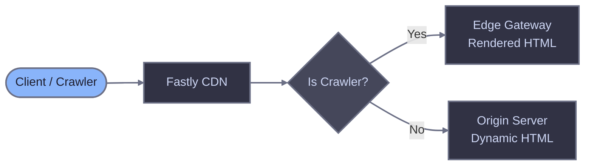

# Fastly CDN

Configure Fastly CDN to route crawler traffic through Edge Gateway for server-side rendering of JavaScript-heavy pages.

## Prerequisites

- Running Edge Gateway instance (see [Quick start](/quick-start))
- Configured host with `render_key` and `domain`
- Fastly account with an active service
- Access to VCL snippets (or custom VCL upload)

## How it works

Fastly sits at the edge and intercepts incoming requests. When a crawler requests a page, Fastly routes the request to Edge Gateway for pre-rendered HTML. Regular users go directly to your origin server, preserving cookies, sessions, and authentication.



Edge Gateway endpoint: `GET /render?url=<target-url>`

Required header: `X-Render-Key` (from your host configuration)

## VCL configuration

Add the following VCL snippets to your Fastly service. Each snippet targets a specific VCL subroutine.

### Backend definition (init)

Define Edge Gateway as a backend. Fastly connects to it over HTTPS when a crawler is detected.

::: code-group

```vcl [snippet: eg_backend_init (init)]
backend edge_comet {
    .host = "render.example.com";
    .port = "443";
    .ssl = true;
    .ssl_sni_hostname = "render.example.com";
    .ssl_cert_hostname = "render.example.com";
    .connect_timeout = 10s;
    .first_byte_timeout = 60s;
    .between_bytes_timeout = 15s;
    .probe = {
        .request = "GET /health HTTP/1.1" "Host: render.example.com" "Connection: close";
        .interval = 30s;
        .timeout = 5s;
        .window = 5;
        .threshold = 3;
        .initial = 3;
    }
}
```

:::

The `.probe` block configures health checks against Edge Gateway's `/health` endpoint. Fastly marks the backend as unhealthy if fewer than 3 of the last 5 checks succeed, automatically routing requests to origin.

Set `.first_byte_timeout` higher than your Edge Gateway `render.timeout` configuration to allow renders to complete.

### Request routing (recv)

Detect crawlers, skip static assets, prevent loops, and route matching requests to Edge Gateway.

::: code-group

```vcl [snippet: eg_router_recv (recv)]
# Loop prevention: if request is from Render Service, pass to origin
if (req.http.X-Edge-Render) {
    return(pass);
}

# Skip static assets
if (req.url.ext ~ "(?i)^(avif|css|eot|gif|gz|ico|jpeg|jpg|js|json|map|mp3|mp4|ogg|otf|pdf|png|svg|ttf|txt|wasm|wav|webm|webp|woff|woff2|xml|zip)$") {
    return(pass);
}

# Crawler detection (broad approach)
declare local var.is_crawler BOOL;
set var.is_crawler = false;

# Generic crawler keywords
if (req.http.User-Agent ~ "(?i)(bot|crawl|spider|slurp)") {
    set var.is_crawler = true;
}

# Crawlers without generic keywords in name
if (req.http.User-Agent ~ "(?i)(WhatsApp|Snapchat|facebookexternalhit|AMZN-User|Claude-User|Perplexity-User|ChatGPT-User)") {
    set var.is_crawler = true;
}

if (var.is_crawler) {
    # Set Edge Gateway backend
    set req.backend = edge_comet;

    # Build the render URL
    set req.http.X-Render-Key = "your_render_key_here";
    set req.http.X-Forwarded-Proto = if(req.is_ssl, "https", "http");
    set req.http.X-Forwarded-For = client.ip;

    # Rewrite URL to Edge Gateway render endpoint
    set req.url = "/render?url=" + urlencode(if(req.is_ssl, "https", "http") + "://" + req.http.Host + req.url);

    return(pass);
}
```

:::

For alternative crawler detection approaches, see the [Fastly reference](./fastly-reference).

### Error handling (error)

Fail open: if Edge Gateway returns a server error, restart the request to serve from origin instead.

::: code-group

```vcl [snippet: eg_failopen_error (error)]
if (req.restarts == 1 && beresp.status >= 500 && req.backend == edge_comet) {
    restart;
}
```

:::

When a restart occurs, the request enters `vcl_recv` again. On the second pass, `req.restarts` equals 1, so the request proceeds to origin without re-entering the Edge Gateway routing logic. Add the restart guard to the recv snippet:

::: code-group

```vcl [snippet: eg_router_recv -- add at the top]
# On restart after EG failure, go to origin
if (req.restarts > 0) {
    return(pass);
}
```

:::

Replace:
- `render.example.com` with your Edge Gateway hostname
- `your_render_key_here` with your host's `render_key`

## Installation

### Option A: Fastly UI (VCL snippets)

1. Log in to the [Fastly management console](https://manage.fastly.com) and select your service

2. Click **Clone to edit** to create a new draft version


3. Navigate to **VCL** > **Snippets** in the left sidebar


4. Click **Create snippet** and add the backend definition:
   - **Name**: `eg_backend_init`
   - **Type**: `init`
   - **VCL**: Paste the [backend definition](#backend-definition-init) snippet


5. Create a second snippet for request routing:
   - **Name**: `eg_router_recv`
   - **Type**: `within subroutine` > `recv`
   - **VCL**: Paste the [request routing](#request-routing-recv) snippet (including the restart guard at the top)


6. Create a third snippet for error handling:
   - **Name**: `eg_failopen_error`
   - **Type**: `within subroutine` > `error`
   - **VCL**: Paste the [error handling](#error-handling-error) snippet

7. Click **Activate** to deploy the new version


8. After activation, purge Fastly's cache to ensure the new VCL takes effect for all requests. Click **Purge** > **Purge all**


### Option B: Custom VCL

If you manage a complete custom VCL file, place each block in its corresponding subroutine:

- Backend definition at the top level (outside any subroutine)
- Request routing logic inside `sub vcl_recv { ... }`
- Error handling inside `sub vcl_backend_error { ... }`

Upload the updated VCL through **VCL Snippets** > **Upload custom VCL** or use the [Fastly CLI](https://developer.fastly.com/reference/cli/).

## Verifying the setup

### Test with jsbug

Use [jsbug.org](https://jsbug.org) to verify that crawlers receive rendered content:

1. Enter your page URL
2. Click the settings icon and select **Googlebot** as the User-Agent
3. Click **Analyze**

The **JS Rendered** panel shows what Edge Gateway returns to crawlers. Compare it with the **Non JS** panel to confirm JavaScript content is being rendered.

### Test with curl

Send a request with a crawler User-Agent:

```bash
curl -v \
  -H "User-Agent: Mozilla/5.0 (compatible; Googlebot/2.1; +http://www.google.com/bot.html)" \
  "https://example.com/"
```

Check response headers:
- `X-Render-Source: rendered` or `X-Render-Source: cache` confirms Edge Gateway processed the request

Test regular user traffic goes directly to origin:

```bash
curl -v \
  -H "User-Agent: Mozilla/5.0 (Macintosh; Intel Mac OS X 10_15_7) AppleWebKit/537.36" \
  "https://example.com/"
```

The request should have no `X-Render-*` headers in response.

## Troubleshooting

### 403 Forbidden from Edge Gateway

- Verify `X-Render-Key` matches your host configuration
- Check the domain in the URL matches your configured `domain`
- Confirm the host is `enabled: true`

### Timeout errors

- Increase `.first_byte_timeout` in the backend definition to exceed your Edge Gateway render timeout
- Check Edge Gateway logs for render failures
- Verify Render Service is running and registered

### Crawlers not being detected

- Use Fastly's real-time logging or `Fastly-Debug` header to inspect `var.is_crawler` evaluation
- Add missing patterns to the crawler detection block
- Verify User-Agent header is being passed correctly

### Infinite loops

- Verify the `X-Edge-Render` header check is present at the top of `vcl_recv`
- Check that no other VCL logic strips this header before the check
- Confirm the restart guard (`req.restarts > 0`) is in place

### Cache not working

- Verify `X-Render-Source` header shows `cache` on repeat crawler requests
- Check `X-Cache-Age` header for cache duration
- Review Edge Gateway cache configuration and storage permissions
- Ensure Fastly's own caching does not interfere -- the `return(pass)` in the recv snippet bypasses Fastly's cache for crawler requests

## Related documentation

- [Fastly reference](./fastly-reference) - Detailed VCL explanations
- [Diagnostic headers](/edge-gateway/x-headers) - Response header reference
- [Dimensions](/edge-gateway/dimensions) - Crawler detection via User-Agent matching
- [Caching](/edge-gateway/caching) - Cache configuration
- [Bypass mode](/edge-gateway/bypass-mode) - Direct origin fetching
