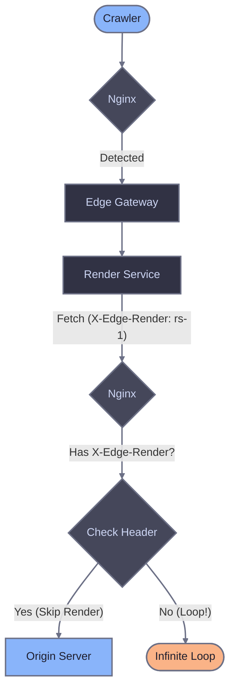

# nginx reference

This page provides detailed explanations of nginx configuration components. For installation and setup, see the [main nginx guide](./nginx).

## Crawler detection approaches

Both approaches route only crawler traffic to Edge Gateway. Regular users always go directly to origin. The difference is how crawlers are identified:

| Approach | Description | Use when |
|----------|-------------|----------|
| Broad (default) | Generic keywords (bot, crawl, spider) + explicit patterns | You want to catch more crawlers including unknown ones |
| Conservative | Explicit list of known crawlers | You want predictable behavior with no false positives |

### Broad detection (default)

Catches crawlers using generic keywords plus explicit patterns for crawlers without these keywords in their name.

::: code-group

```nginx [nginx/conf.d/edge-gateway-map.conf]
# 1. Detect crawlers by User-Agent
map $http_user_agent $eg_crawler {
    default 0;

    # Generic crawler keywords
    "~*bot"                       1;
    "~*crawl"                     1;
    "~*spider"                    1;
    "~*slurp"                     1;

    # Crawlers without generic keywords in name
    "~*WhatsApp"                  1;
    "~*Snapchat"                  1;
    "~*facebookexternalhit"       1;
    "~*AMZN-User"                 1;
    "~*Claude-User"               1;
    "~*Perplexity-User"           1;
    "~*ChatGPT-User"              1;
}

# 2. Skip static assets (inherits $eg_crawler, disables for static files)
map $uri $eg_skip_render {
    default $eg_crawler;
    "~*\.(avif|css|eot|gif|gz|ico|jpeg|jpg|js|json|map|mp3|mp4|ogg|otf|pdf|png|svg|ttf|txt|wasm|wav|webm|webp|woff|woff2|xml|zip)$" 0;
}

# 3. Loop prevention (inherits $eg_skip_render, disables for renderer callbacks)
map $http_x_edge_render $eg_should_render {
    default $eg_skip_render;
    "~."    0;
}
```

:::

### Conservative detection

Explicit patterns for known search engines, AI crawlers, social media, and messengers based on [bot aliases](/edge-gateway/dimensions#available-aliases).

To use this approach, replace the map configuration file with the one below.

::: code-group

```nginx [nginx/conf.d/edge-gateway-map.conf]
# 1. Detect crawlers by User-Agent
map $http_user_agent $eg_crawler {
    default 0;

    # Search engines ($SearchBots alias)
    "~*Googlebot"                 1;
    "~*bingbot"                   1;

    # AI crawlers ($AIBots alias)
    "~*ChatGPT-User"              1;
    "~*GPTBot"                    1;
    "~*OAI-SearchBot"             1;
    "~*PerplexityBot"             1;
    "~*Perplexity-User"           1;
    "~*ClaudeBot"                 1;
    "~*Claude-User"               1;
    "~*Claude-SearchBot"          1;
    "~*Amazonbot"                 1;
    "~*AMZN-User"                 1;

    # Google Ads bots
    "~*AdsBot-Google"             1;
    "~*AdsBot-Google-Mobile"      1;

    # Social media ($Socials alias)
    "~*facebookexternalhit"       1;
    "~*twitterbot"                1;
    "~*Pinterestbot"              1;
    "~*Applebot"                  1;
    "~*LinkedInBot"               1;

    # Messengers ($Messengers alias)
    "~*WhatsApp"                  1;
    "~*Telegrambot"               1;
    "~*ViberBot"                  1;
    "~*Snapchat"                  1;
    "~*Discordbot"                1;
    "~*Slackbot"                  1;
}

# 2. Skip static assets (inherits $eg_crawler, disables for static files)
map $uri $eg_skip_render {
    default $eg_crawler;
    "~*\.(avif|css|eot|gif|gz|ico|jpeg|jpg|js|json|map|mp3|mp4|ogg|otf|pdf|png|svg|ttf|txt|wasm|wav|webm|webp|woff|woff2|xml|zip)$" 0;
}

# 3. Loop prevention (inherits $eg_skip_render, disables for renderer callbacks)
map $http_x_edge_render $eg_should_render {
    default $eg_skip_render;
    "~."    0;
}
```

:::

## Loop prevention

When Edge Gateway renders a page, the Render Service fetches the target URL from your origin server. Without loop prevention, nginx would detect the Render Service request as a crawler and route it back to Edge Gateway, creating an infinite loop.

The Render Service adds an `X-Edge-Render` header to outgoing requests. The map chain detects this header and sets `$eg_should_render` to 0, preventing re-routing.



The loop prevention logic in the final map:

```nginx
# 3. Loop prevention (inherits $eg_skip_render, disables for renderer callbacks)
map $http_x_edge_render $eg_should_render {
    default $eg_skip_render;
    "~."    0;  # Any non-empty X-Edge-Render header disables rendering
}
```

## Configuration reference

### Required headers

| Header | Description |
|--------|-------------|
| `X-Render-Key` | Authentication token from host configuration. |
| `User-Agent` | Original client User-Agent passed to EG for dimension matching. |

### Recommended headers

| Header | Description |
|--------|-------------|
| `X-Real-IP` | Original client IP address for logging and rate limiting. |
| `X-Forwarded-For` | Client IP chain for proxied requests. |
| `X-Forwarded-Proto` | Original request protocol (http/https). |
| `X-Request-ID` | Custom request ID for distributed tracing. |

### Recommended timeouts

```nginx
proxy_connect_timeout 10s;
proxy_read_timeout 60s;
proxy_send_timeout 10s;
```

Set `proxy_read_timeout` higher than your EG `render.timeout` configuration.

### Logging Edge Gateway responses

Add a custom log format to track rendering:

```nginx
log_format rendering '$remote_addr [$time_local] "$request" $status '
                     'ua="$http_user_agent" '
                     'render_src=$upstream_http_x_render_source '
                     'cache=$upstream_http_x_render_cache '
                     'age=$upstream_http_x_cache_age '
                     'req_id=$upstream_http_x_request_id';

access_log /var/log/nginx/rendering.log rendering;
```

## Related documentation

- [nginx setup](./nginx) - Installation and configuration
- [Diagnostic headers](/edge-gateway/x-headers) - Response header reference
- [Dimensions](/edge-gateway/dimensions) - Crawler detection via User-Agent matching
- [Caching](/edge-gateway/caching) - Cache configuration
