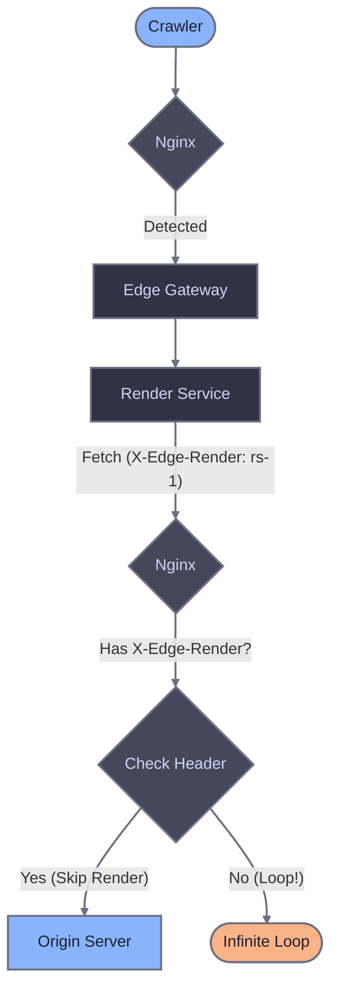

# nginx reference

This page provides detailed explanations of nginx configuration components. For installation and setup, see the [main nginx guide](./nginx).

## Crawler detection approaches

Both approaches route only crawler traffic to Edge Gateway. Regular users always go directly to origin. The difference is how crawlers are identified:

| Approach | Description | Use when |
|----------|-------------|----------|
| Broad (default) | Generic keywords (bot, crawl, spider) + explicit patterns | You want to catch more crawlers including unknown ones |
| Conservative | Explicit list of known crawlers | You want predictable behavior with no false positives |

### Broad detection (default)

Catches crawlers using generic keywords plus explicit patterns for crawlers without these keywords in their name.

::: code-group

```nginx [nginx/conf.d/edge-comet-map.conf]
# 1. Detect crawlers by User-Agent
map $http_user_agent $ec_crawler {
    default 0;

    # Generic crawler keywords
    "~*bot"                       1;
    "~*crawl"                     1;
    "~*spider"                    1;
    "~*slurp"                     1;

    # Crawlers without generic keywords in name
    "~*WhatsApp"                  1;
    "~*Snapchat"                  1;
    "~*facebookexternalhit"       1;
    "~*AMZN-User"                 1;
    "~*Claude-User"               1;
    "~*Perplexity-User"           1;
    "~*ChatGPT-User"              1;
}

# 2. Skip static assets (inherits $ec_crawler, disables for static files)
map $uri $ec_skip_render {
    default $ec_crawler;
    "~*\.(avif|css|eot|gif|gz|ico|jpeg|jpg|js|json|map|mp3|mp4|ogg|otf|pdf|png|svg|ttf|txt|wasm|wav|webm|webp|woff|woff2|xml|zip)$" 0;
}

# 3. Loop prevention (inherits $ec_skip_render, disables for renderer callbacks)
map $http_x_edge_render $ec_should_render {
    default $ec_skip_render;
    "~."    0;
}
```

:::

### Conservative detection

Explicit patterns for known search engines, AI crawlers, social media, and messengers based on [bot aliases](/edge-gateway/dimensions#available-aliases).

To use this approach, replace the map configuration file with the one below.

::: code-group

```nginx [nginx/conf.d/edge-comet-map.conf]
# 1. Detect crawlers by User-Agent
map $http_user_agent $ec_crawler {
    default 0;

    # Search engines ($SearchBots alias)
    "~*Googlebot"                 1;
    "~*bingbot"                   1;

    # AI crawlers ($AIBots alias)
    "~*ChatGPT-User"              1;
    "~*GPTBot"                    1;
    "~*OAI-SearchBot"             1;
    "~*OAI-AdsBot"                1;
    "~*PerplexityBot"             1;
    "~*Perplexity-User"           1;
    "~*ClaudeBot"                 1;
    "~*Claude-User"               1;
    "~*Claude-SearchBot"          1;
    "~*Amazonbot"                 1;
    "~*AMZN-User"                 1;
    "~*Google-Agent"              1;

    # Google Ads bots
    "~*AdsBot-Google"             1;
    "~*AdsBot-Google-Mobile"      1;

    # Social media ($Socials alias)
    "~*facebookexternalhit"       1;
    "~*twitterbot"                1;
    "~*Pinterestbot"              1;
    "~*Applebot"                  1;
    "~*LinkedInBot"               1;

    # Messengers ($Messengers alias)
    "~*WhatsApp"                  1;
    "~*Telegrambot"               1;
    "~*ViberBot"                  1;
    "~*Snapchat"                  1;
    "~*Discordbot"                1;
    "~*Slackbot"                  1;
}

# 2. Skip static assets (inherits $ec_crawler, disables for static files)
map $uri $ec_skip_render {
    default $ec_crawler;
    "~*\.(avif|css|eot|gif|gz|ico|jpeg|jpg|js|json|map|mp3|mp4|ogg|otf|pdf|png|svg|ttf|txt|wasm|wav|webm|webp|woff|woff2|xml|zip)$" 0;
}

# 3. Loop prevention (inherits $ec_skip_render, disables for renderer callbacks)
map $http_x_edge_render $ec_should_render {
    default $ec_skip_render;
    "~."    0;
}
```

:::

## Loop prevention

When Edge Gateway renders a page, the Render Service fetches the target URL from your origin server. Without loop prevention, nginx would detect the Render Service request as a crawler and route it back to Edge Gateway, creating an infinite loop.

EdgeComet adds an `X-Edge-Render` header to its outgoing requests, both from the Render Service (Chrome fetches) and the Edge Gateway (bypass fetches, including bypass pre-cache). The map chain detects this header and sets `$ec_should_render` to 0, preventing re-routing.


```mermaid
flowchart TD
    %% Palette Definitions
    classDef entry fill:#89B4FA,stroke:#6C7086,stroke-width:2px,color:#1E1E2E;
    classDef process fill:#313244,stroke:#6C7086,stroke-width:2px,color:#CDD6F4;
    classDef decision fill:#45475A,stroke:#6C7086,stroke-width:2px,color:#CDD6F4;
    classDef failure fill:#FAB387,stroke:#6C7086,stroke-width:2px,color:#1E1E2E;

    Crawler([Crawler]) --> Nginx1{Nginx}
    Nginx1 -- "Detected" --> EG[Edge Gateway]
    EG --> RS[Render Service]
    RS -- "Fetch (X-Edge-Render: rs-1)" --> Nginx2{Nginx}

    Nginx2 -- "Has X-Edge-Render?" --> Check{Check Header}
    Check -- Yes (Skip Render) --> Origin[Origin Server]
    Check -- No (Loop!) --> Failure([Infinite Loop])

    class Crawler,Origin entry;
    class EG,RS process;
    class Nginx1,Nginx2,Check decision;
    class Failure failure;

    linkStyle default stroke:#6C7086,stroke-width:2px;
```

The loop prevention logic in the final map:

```nginx
# 3. Loop prevention (inherits $ec_skip_render, disables for renderer callbacks)
map $http_x_edge_render $ec_should_render {
    default $ec_skip_render;
    "~."    0;  # Any non-empty X-Edge-Render header disables rendering
}
```

## Configuration reference

### Required headers

| Header | Description |
|--------|-------------|
| `X-Render-Key` | Authentication token from host configuration. |
| `User-Agent` | Original client User-Agent passed to EG for dimension matching. |

### Recommended headers

| Header | Description |
|--------|-------------|
| `X-Real-IP` | Original client IP address for logging and rate limiting. |
| `X-Forwarded-For` | Client IP chain for proxied requests. |
| `X-Forwarded-Proto` | Original request protocol (http/https). |
| `EC-Request-ID` | Custom request ID for distributed tracing. |

### Recommended timeouts

```nginx
proxy_connect_timeout 10s;
proxy_read_timeout 60s;
proxy_send_timeout 10s;
```

Set `proxy_read_timeout` higher than your EG `render.timeout` configuration.

### Connection reuse

Pooled connections to Edge Gateway need three things, and missing any one of them makes the change a silent no-op:

```nginx
upstream rendergw {
    server 127.0.0.1:10070;

    keepalive 8;
}

location @edge_render {
    proxy_http_version 1.1;
    proxy_set_header Connection "";
    ...
}
```

`keepalive` only works inside an `upstream` block. A bare `proxy_pass http://127.0.0.1:10070` cannot pool connections.

Directive versions and defaults:

| Directive | Context | Default | Available since |
|-----------|---------|---------|-----------------|
| `keepalive` | `upstream` | Enabled at 32 per worker since nginx 1.29.7, otherwise off | 1.1.4 |
| `keepalive_timeout` | `upstream` | 60s | 1.15.3 |
| `keepalive_requests` | `upstream` | 1000 (100 before 1.19.10) | 1.15.3 |
| `keepalive_time` | `upstream` | 1h | 1.19.10 |
| `proxy_http_version` | `location` | 1.1 since nginx 1.29.7, 1.0 before | 1.1.4 |

On nginx 1.29.7 and later, HTTP/1.1 is the default, the `Connection` header is cleared automatically, and upstream keepalive is on by default. Setting all three explicitly stays correct on those versions and is required on older ones.

`keepalive` counts idle connections cached per worker process, not concurrent requests. Crawler traffic is low-concurrency, so a small number covers bursts.

Leave `keepalive_requests` at its default. Recycling a connection after 1000 requests is reasonable hygiene.

#### Choosing keepalive_timeout

nginx should always be the side that closes an idle connection. If the other end closes first, nginx can put a request onto a connection that is already being torn down; it retries idempotent requests, but the error and retry are avoidable.

| Upstream | Value | Reason |
|----------|-------|--------|
| Edge Gateway directly | 60s default | EG sets its idle timeout from `server.timeout`, which is 120s in the sample config. |
| HTTPS endpoint behind Cloudflare | `keepalive_timeout 300s;` | Cloudflare closes idle client connections at 400s and the limit is not configurable. |

For HTTPS upstreams, add `proxy_ssl_server_name on;` (nginx 1.7.0+) so SNI is sent.

### Origin failover

`proxy_intercept_errors` combined with `error_page` sends crawlers to your origin when Edge Gateway fails:

```nginx
location / {
    recursive_error_pages on;

    error_page 418 = @edge_render;
    if ($ec_should_render = 1) {
        return 418;
    }
    ...
}

location @edge_render {
    internal;
    ...
    proxy_intercept_errors on;
    error_page 500 502 503 504 = @origin_fallback;
    proxy_connect_timeout 3s;
}

location @origin_fallback {
    internal;
    proxy_pass http://127.0.0.1:3000;
    proxy_set_header Host $host;
}
```

`recursive_error_pages` is off by default and limits the configuration to a single `error_page` redirect per request. Routing crawlers to `@edge_render` already spends that one redirect, so without enabling it the failover redirect never fires and the crawler receives the gateway error. It has to be enabled in the location that issues the first redirect, `location /`, or inherited from the enclosing `server` block. Setting it inside `@edge_render` has no effect.

Behavior by failure mode:

| Situation | Result |
|-----------|--------|
| Edge Gateway unreachable | nginx generates 502 or 504, `error_page` fires, origin serves the page. |
| Edge Gateway returns 5xx | `proxy_intercept_errors` captures the response and re-routes it to the origin. |
| Edge Gateway returns 403, 404, 410, or a redirect | Passed to the crawler unchanged. Only listed codes are intercepted. |
| Edge Gateway accepts but never responds | Fails over after `proxy_read_timeout`, since a shorter value would cut off legitimate long renders. |
| Origin returns 5xx through bypass mode | Intercepted and refetched from the origin once, so the failing page costs one extra request. |

Stock nginx cannot inspect a successful response and re-route based on missing `EC-*` headers, which would need njs or Lua. Status and timeout interception covers the outage modes that occur in practice.

### Logging Edge Gateway responses

Add a custom log format to track rendering:

```nginx
log_format rendering '$remote_addr [$time_local] "$request" $status '
                     'ua="$http_user_agent" '
                     'connect=$upstream_connect_time '
                     'render_src=$upstream_http_ec_source '
                     'age=$upstream_http_ec_cache_age '
                     'req_id=$upstream_http_ec_request_id';

access_log /var/log/nginx/rendering.log rendering;
```

`$upstream_connect_time` reads `0.000` on a reused connection and shows the handshake cost otherwise, which makes it the direct check on whether connection reuse is working.

## Related documentation

- [nginx setup](./nginx) - Installation and configuration
- [Diagnostic headers](/edge-gateway/x-headers) - Response header reference
- [Dimensions](/edge-gateway/dimensions) - Crawler detection via User-Agent matching
- [Caching](/edge-gateway/caching) - Cache configuration
