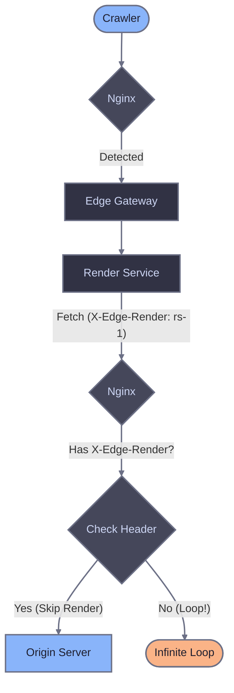

# nginx reverse proxy

Configure nginx as a reverse proxy to route crawler traffic through Edge Gateway for server-side rendering of JavaScript-heavy pages.

## Prerequisites

- Running Edge Gateway instance (see [Quick Start](/quick-start))
- Configured host with `render_key` and `domain`
- nginx 1.14+ with `ngx_http_proxy_module`

## How it works

nginx sits between clients and your origin server. When a crawler requests a page, nginx routes the request to Edge Gateway for pre-rendered HTML. Regular users go directly to your origin server, preserving cookies, sessions, and authentication.


Edge Gateway endpoint: `GET /render?url=<target-url>`

Required header: `X-Render-Key` (from your host configuration)

## Crawler detection approaches

Both approaches route only crawler traffic to Edge Gateway. Regular users always go directly to origin. The difference is how crawlers are identified:

| Approach | Description | Use when |
|----------|-------------|----------|
| Conservative | Explicit list of known crawlers | You want predictable behavior with no false positives |
| Broad | Generic keywords (bot, crawl, spider) + explicit patterns | You want to catch more crawlers including unknown ones |

## Option A: Broad crawler detection

Catches crawlers using generic keywords plus explicit patterns for crawlers without these keywords in their name.

### Map configuration

Use this `map` block instead of the one in Option B.

::: code-group

```nginx [nginx/conf.d/edge-gateway-map.conf]
# 1. Detect crawlers by User-Agent
map $http_user_agent $eg_crawler {
    default 0;

    # Generic crawler keywords
    "~*bot"                       1;
    "~*crawl"                     1;
    "~*spider"                    1;
    "~*slurp"                     1;

    # Crawlers without generic keywords in name
    "~*WhatsApp"                  1;
    "~*Snapchat"                  1;
    "~*facebookexternalhit"       1;
    "~*AMZN-User"                 1;
    "~*Claude-User"               1;
    "~*Perplexity-User"           1;
    "~*ChatGPT-User"              1;
}

# 2. Skip static assets (inherits $eg_crawler, disables for static files)
map $uri $eg_skip_render {
    default $eg_crawler;
    "~*\.(avif|css|eot|gif|gz|ico|jpeg|jpg|js|json|map|mp3|mp4|ogg|otf|pdf|png|svg|ttf|txt|wasm|wav|webm|webp|woff|woff2|xml|zip)$" 0;
}

# 3. Loop prevention (inherits $eg_skip_render, disables for renderer callbacks)
map $http_x_edge_render $eg_should_render {
    default $eg_skip_render;
    "~."    0;
}
```

:::

## Option B: Conservative crawler list

Explicit patterns for known search engines, AI crawlers, social media, and messengers based on [bot aliases](/edge-gateway/dimensions#available-aliases).

Maintain detection logic in a separate file and include it in your server block.

::: code-group

```nginx [nginx/conf.d/edge-gateway-map.conf]
# 1. Detect crawlers by User-Agent
map $http_user_agent $eg_crawler {
    default 0;

    # Search engines ($SearchBots alias)
    "~*Googlebot"                 1;
    "~*bingbot"                   1;

    # AI crawlers ($AIBots alias)
    "~*ChatGPT-User"              1;
    "~*GPTBot"                    1;
    "~*OAI-SearchBot"             1;
    "~*PerplexityBot"             1;
    "~*Perplexity-User"           1;
    "~*ClaudeBot"                 1;
    "~*Claude-User"               1;
    "~*Claude-SearchBot"          1;
    "~*Amazonbot"                 1;
    "~*AMZN-User"                 1;

    # Google Ads bots
    "~*AdsBot-Google"             1;
    "~*AdsBot-Google-Mobile"      1;

    # Social media ($Socials alias)
    "~*facebookexternalhit"       1;
    "~*twitterbot"                1;
    "~*Pinterestbot"              1;
    "~*Applebot"                  1;
    "~*LinkedInBot"               1;

    # Messengers ($Messengers alias)
    "~*WhatsApp"                  1;
    "~*Telegrambot"               1;
    "~*ViberBot"                  1;
    "~*Snapchat"                  1;
    "~*Discordbot"                1;
    "~*Slackbot"                  1;
}

# 2. Skip static assets (inherits $eg_crawler, disables for static files)
map $uri $eg_skip_render {
    default $eg_crawler;
    "~*\.(avif|css|eot|gif|gz|ico|jpeg|jpg|js|json|map|mp3|mp4|ogg|otf|pdf|png|svg|ttf|txt|wasm|wav|webm|webp|woff|woff2|xml|zip)$" 0;
}

# 3. Loop prevention (inherits $eg_skip_render, disables for renderer callbacks)
map $http_x_edge_render $eg_should_render {
    default $eg_skip_render;
    "~."    0;
}
```

:::

## Server configuration

The server block is identical for both detection approaches. Include the map configuration file and use the `$eg_should_render` variable to route crawler traffic.

```nginx [nginx/sites-enabled/example.com.conf]
# Define upstreams for flexibility
upstream backend {
    server 127.0.0.1:3000;
}

upstream rendergw {
    server 127.0.0.1:10070;
}

server {
    listen 80;
    server_name example.com;

    # Include the detection logic
    include conf.d/edge-gateway-map.conf;

    location / {
        # Route crawlers to Edge Gateway (logic computed in maps above)
        error_page 418 = @edge_render;
        if ($eg_should_render = 1) {
            return 418;
        }

        # Regular traffic goes to origin
        proxy_pass http://backend;
        proxy_set_header Host $host;
        proxy_set_header X-Real-IP $remote_addr;
        proxy_set_header X-Forwarded-For $proxy_add_x_forwarded_for;
        proxy_set_header X-Forwarded-Proto $scheme;
    }

    location @edge_render {
        internal;

        proxy_pass http://rendergw/render?url=$scheme://$host$request_uri;

        proxy_set_header X-Render-Key "your_render_key_here";
        proxy_set_header User-Agent $http_user_agent;

        # Forward original client details
        proxy_set_header X-Real-IP $remote_addr;
        proxy_set_header X-Forwarded-For $proxy_add_x_forwarded_for;
        proxy_set_header X-Forwarded-Proto $scheme;
        proxy_set_header X-Request-ID $request_id;

        # Timeouts should exceed EG render timeout
        proxy_connect_timeout 10s;
        proxy_read_timeout 60s;
        proxy_send_timeout 10s;
    }
}
```

Replace:
- `127.0.0.1:3000` with your origin server address.
- `127.0.0.1:10070` with your Edge Gateway address.
- `your_render_key_here` with your host's `render_key`.
- `example.com` with your domain.

## Loop prevention

When Edge Gateway renders a page, the Render Service fetches the target URL from your origin server. Without loop prevention, nginx would detect the Render Service request as a crawler and route it back to Edge Gateway, creating an infinite loop.

The Render Service adds an `X-Edge-Render` header to outgoing requests. The map chain detects this header and sets `$eg_should_render` to 0, preventing re-routing.



The loop prevention logic in the final map:

```nginx
# 3. Loop prevention (inherits $eg_skip_render, disables for renderer callbacks)
map $http_x_edge_render $eg_should_render {
    default $eg_skip_render;
    "~."    0;  # Any non-empty X-Edge-Render header disables rendering
}
```

## Configuration reference

### Required headers

| Header | Description |
|--------|-------------|
| `X-Render-Key` | Authentication token from host configuration |
| `User-Agent` | Original client User-Agent passed to EG for dimension matching |

### Recommended headers

| Header | Description |
|--------|-------------|
| `X-Real-IP` | Original client IP address for logging and rate limiting |
| `X-Forwarded-For` | Client IP chain for proxied requests |
| `X-Forwarded-Proto` | Original request protocol (http/https) |
| `X-Request-ID` | Custom request ID for distributed tracing |

### Recommended timeouts

```nginx
proxy_connect_timeout 10s;
proxy_read_timeout 60s;
proxy_send_timeout 10s;
```

Set `proxy_read_timeout` higher than your EG `render.timeout` configuration.

### Logging Edge Gateway responses

Add a custom log format to track rendering:

```nginx
log_format rendering '$remote_addr [$time_local] "$request" $status ' 
                     'ua="$http_user_agent" ' 
                     'render_src=$upstream_http_x_render_source ' 
                     'cache=$upstream_http_x_render_cache ' 
                     'age=$upstream_http_x_cache_age ' 
                     'req_id=$upstream_http_x_request_id';

access_log /var/log/nginx/rendering.log rendering;
```

## Verifying the setup

### Test crawler detection

Send a request with a crawler User-Agent:

```bash
curl -v \
  -H "User-Agent: Mozilla/5.0 (compatible; Googlebot/2.1; +http://www.google.com/bot.html)" \
  "http://example.com/"
```

Check response headers:
- `X-Render-Source: rendered` or `X-Render-Source: cache` confirms EG processed the request.

### Test regular user

Send a request with a browser User-Agent:

```bash
curl -v \
  -H "User-Agent: Mozilla/5.0 (Macintosh; Intel Mac OS X 10_15_7) AppleWebKit/537.36" \
  "http://example.com/"
```

Request should go directly to origin with no `X-Render-*` headers in response.

### Debug crawler detection

Add a temporary header to see the final rendering decision:

```nginx
add_header X-EG-Should-Render $eg_should_render;
```

## Troubleshooting

### 403 Forbidden from Edge Gateway

- Verify `X-Render-Key` matches your host configuration.
- Check the domain in the URL matches your configured `domain`.
- Confirm the host is `enabled: true`.

### Timeout errors

- Increase `proxy_read_timeout` to exceed your EG render timeout.
- Check EG logs for render failures.
- Verify render service is running and registered.

### Crawlers not being detected

- Check the value of `$eg_should_render` using the debug header above.
- Add missing patterns to the `$eg_crawler` map block.
- Verify User-Agent header is being passed correctly.

### Infinite Loops

- Ensure `proxy_pass` in the `@edge_render` block uses variables like `$scheme` and `$host` correctly.
- Verify that `X-Edge-Render` header is not being stripped by any other proxy in the chain.

### Cache not working

- Verify `X-Render-Source` header shows `cache` on repeat requests.
- Check `X-Cache-Age` header for cache duration.
- Review EG cache configuration and storage permissions.
- Ensure nginx itself is not agressively caching the render endpoint (unless configured to respect Vary headers).

## Related documentation

- [Diagnostic headers](/edge-gateway/x-headers) - Response header reference
- [Dimensions](/edge-gateway/dimensions) - Crawler detection via User-Agent matching
- [Caching](/edge-gateway/caching) - Cache configuration
- [Bypass mode](/edge-gateway/bypass-mode) - Direct origin fetching