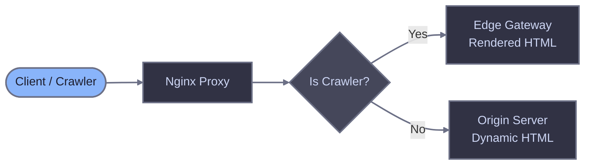

# nginx reverse proxy

Configure nginx as a reverse proxy to route crawler traffic through Edge Gateway for server-side rendering of JavaScript-heavy pages.

## Prerequisites

- Running Edge Gateway instance (see [Quick Start](/quick-start))
- Configured host with `render_key` and `domain`
- nginx 1.14+ with `ngx_http_proxy_module`

## How it works

nginx sits between clients and your origin server. When a crawler requests a page, nginx routes the request to Edge Gateway for pre-rendered HTML. Regular users go directly to your origin server, preserving cookies, sessions, and authentication.


```mermaid
flowchart LR
    %% Palette Definitions
    classDef entry fill:#89B4FA,stroke:#6C7086,stroke-width:2px,color:#1E1E2E;
    classDef process fill:#313244,stroke:#6C7086,stroke-width:2px,color:#CDD6F4;
    classDef decision fill:#45475A,stroke:#6C7086,stroke-width:2px,color:#CDD6F4;

    Client([Client / Crawler])
    Nginx[Nginx Proxy]
    IsCrawler{Is Crawler?}
    EG[Edge Gateway<br>Rendered HTML]
    Origin[Origin Server<br>Dynamic HTML]

    Client --> Nginx
    Nginx --> IsCrawler

    IsCrawler -- Yes --> EG
    IsCrawler -- No --> Origin

    class Client entry;
    class Nginx,EG,Origin process;
    class IsCrawler decision;

    linkStyle default stroke:#6C7086,stroke-width:2px;
```

Edge Gateway endpoint: `GET /render?url=<target-url>`

Required header: `X-Render-Key` (from your host configuration)

## Map configuration

Maintain detection logic in a separate file and include it in the `http` context (map directives cannot be inside a `server` block). This configuration catches crawlers using generic keywords plus explicit patterns for crawlers without these keywords in their name.

::: code-group

```nginx [nginx/conf.d/edge-comet-map.conf]
# 1. Detect crawlers by User-Agent
map $http_user_agent $ec_crawler {
    default 0;

    # Generic crawler keywords
    "~*bot"                       1;
    "~*crawl"                     1;
    "~*spider"                    1;
    "~*slurp"                     1;

    # Crawlers without generic keywords in name
    "~*WhatsApp"                  1;
    "~*Snapchat"                  1;
    "~*facebookexternalhit"       1;
    "~*AMZN-User"                 1;
    "~*Claude-User"               1;
    "~*Perplexity-User"           1;
    "~*ChatGPT-User"              1;
}

# 2. Skip static assets (inherits $ec_crawler, disables for static files)
map $uri $ec_skip_render {
    default $ec_crawler;
    "~*\.(avif|css|eot|gif|gz|ico|jpeg|jpg|js|json|map|mp3|mp4|ogg|otf|pdf|png|svg|ttf|txt|wasm|wav|webm|webp|woff|woff2|xml|zip)$" 0;
}

# 3. Loop prevention (inherits $ec_skip_render, disables for EdgeComet callbacks: render and bypass fetches)
map $http_x_edge_render $ec_should_render {
    default $ec_skip_render;
    "~."    0;
}
```

:::

For alternative crawler detection approaches and detailed configuration explanations, see the [nginx reference](./nginx-reference).

## Server configuration

Use the `$ec_should_render` variable from the map configuration to route crawler traffic.

```nginx [nginx/sites-enabled/example.com.conf]
upstream rendergw {
    server 127.0.0.1:10070;

    # Reuse connections instead of handshaking on every crawler request
    keepalive 8;
}

# Map directives require http context (outside server block)
include conf.d/edge-comet-map.conf;

server {
    listen 80;
    server_name example.com;

    location / {
        # Route crawlers to Edge Gateway (logic computed in maps above)
        error_page 418 = @edge_render;
        if ($ec_should_render = 1) {
            return 418;
        }

        # ... your existing proxy configuration ...
    }

    location @edge_render {
        internal;

        proxy_pass http://rendergw/render?url=$scheme://$host$request_uri;

        # Connection reuse requires HTTP/1.1 and an empty Connection header.
        # Both are defaults since nginx 1.29.7 and required before it.
        proxy_http_version 1.1;
        proxy_set_header Connection "";

        proxy_set_header X-Render-Key "your_render_key_here";
        proxy_set_header User-Agent $http_user_agent;

        # Forward original client details
        proxy_set_header X-Real-IP $remote_addr;
        proxy_set_header X-Forwarded-For $proxy_add_x_forwarded_for;
        proxy_set_header X-Forwarded-Proto $scheme;
        proxy_set_header EC-Request-ID $request_id;

        # Timeouts should exceed EG render timeout
        proxy_connect_timeout 10s;
        proxy_read_timeout 60s;
        proxy_send_timeout 10s;
    }
}
```

Replace:
- `127.0.0.1:3000` with your origin server address.
- `127.0.0.1:10070` with your Edge Gateway address.
- `your_render_key_here` with your host's `render_key`.
- `example.com` with your domain.

## Connection reuse

nginx pools connections to Edge Gateway only when the `upstream` block enables keepalive and the proxy speaks HTTP/1.1 with an empty `Connection` header. None of that is the default before nginx 1.29.7, so on those versions every crawler request opens a new connection.

Crawlers fetch in bursts, so the pool stays warm exactly when it matters: the first request of a burst still handshakes, the rest reuse the connection.

The saving is one TCP round trip for a local Edge Gateway, and a TCP plus TLS handshake for a remote one. It shows up on cache hits, where the handshake is a large share of total response time, and disappears into the noise on fresh renders that take seconds.

Idle connections must be closed by nginx rather than by the other end, otherwise nginx can send a request onto a connection that is already being torn down. Keep `keepalive_timeout` in the `upstream` block below the idle timeout of whatever nginx connects to:

| Upstream | nginx `keepalive_timeout` | Why |
|----------|---------------------------|-----|
| Edge Gateway directly | leave the 60s default | EG idle timeout equals `server.timeout` (120s in the sample config). |
| An HTTPS endpoint behind a CDN | below the CDN idle limit | Cloudflare closes idle client connections at 400s, so 300s is safe. |

For an HTTPS upstream, also set `proxy_ssl_server_name on;` so SNI is sent.

See the [nginx reference](./nginx-reference) for version requirements and verification.

## Origin failover

Serve the page from your origin when Edge Gateway is unreachable or returns a server error, so a rendering outage does not turn into an outage for crawlers.

```nginx [nginx/sites-enabled/example.com.conf]
server {
    location / {
        # Required: routing to @edge_render already spends one error_page
        # redirect, and the failover below needs a second one
        recursive_error_pages on;

        error_page 418 = @edge_render;
        if ($ec_should_render = 1) {
            return 418;
        }

        # ... your existing proxy configuration ...
    }

    location @edge_render {
        internal;

        # ... proxy_pass and headers as above ...

        proxy_intercept_errors on;
        error_page 500 502 503 504 = @origin_fallback;

        proxy_connect_timeout 3s;
    }

    location @origin_fallback {
        internal;

        # Mirror the origin configuration from "location /"
        proxy_pass http://127.0.0.1:3000;
        proxy_set_header Host $host;
        proxy_set_header X-Real-IP $remote_addr;
        proxy_set_header X-Forwarded-For $proxy_add_x_forwarded_for;
        proxy_set_header X-Forwarded-Proto $scheme;
    }
}
```

This covers both outage modes. An unreachable Edge Gateway makes nginx generate its own 502 or 504, and `proxy_connect_timeout 3s` keeps that detection fast. An Edge Gateway that responds with 5xx is intercepted by `proxy_intercept_errors` and re-routed the same way.

Only the codes listed in `error_page` are intercepted, so status actions (403, 404, 410), redirects, and origin 404s relayed through bypass still reach the crawler unchanged.

Two limits are worth knowing. An Edge Gateway that accepts the connection but never responds fails over only after `proxy_read_timeout`, which cannot be shortened without cutting off legitimate long renders. And if your origin itself returns a 5xx through bypass mode, nginx intercepts it and fetches the origin a second time, which costs one extra request on an already failing page.

## Verifying the setup

### Test crawler detection

Send a request with a crawler User-Agent:

```bash
curl -v \
  -H "User-Agent: Mozilla/5.0 (compatible; Googlebot/2.1; +http://www.google.com/bot.html)" \
  "http://example.com/"
```

Check response headers:
- `EC-Source: render` or `EC-Source: render_cache` confirms EG processed the request.

### Test regular user

Send a request with a browser User-Agent:

```bash
curl -v \
  -H "User-Agent: Mozilla/5.0 (Macintosh; Intel Mac OS X 10_15_7) AppleWebKit/537.36" \
  "http://example.com/"
```

Request should go directly to origin with no `EC-*` headers in response.

### Debug crawler detection

Add a temporary header to see the final rendering decision:

```nginx
add_header X-EC-Should-Render $ec_should_render;
```

### Test connection reuse

Add `$upstream_connect_time` to your log format (see the [nginx reference](./nginx-reference)) and watch crawler requests. Reused connections log `connect=0.000`, while the first request after an idle gap still shows the handshake cost.

### Test origin failover

Stop Edge Gateway and send a crawler request. You should get your origin page with a 200 status and no `EC-*` headers, not a 502.

## Troubleshooting

### 403 Forbidden from Edge Gateway

- Verify `X-Render-Key` matches your host configuration.
- Check the domain in the URL matches your configured `domain`.
- Confirm the host is `enabled: true`.

### Timeout errors

- Increase `proxy_read_timeout` to exceed your EG render timeout.
- Check EG logs for render failures.
- Verify render service is running and registered.

### Crawlers not being detected

- Check the value of `$ec_should_render` using the debug header above.
- Add missing patterns to the `$ec_crawler` map block.
- Verify User-Agent header is being passed correctly.

### Infinite loops

- Ensure `proxy_pass` in the `@edge_render` block uses variables like `$scheme` and `$host` correctly.
- Verify that `X-Edge-Render` header is not being stripped by any other proxy in the chain.

### Connections not being reused

- Confirm `proxy_set_header Connection "";` is present. Without it nginx sends `Connection: close` on nginx before 1.29.7 and the pool never forms, with no error to show for it.
- Confirm `proxy_http_version 1.1;` is present on nginx before 1.29.7, where the default is HTTP/1.0.
- Check that `keepalive` sits inside the `upstream` block. It has no effect next to `proxy_pass`, and a bare `proxy_pass http://host` without an `upstream` block cannot pool at all.
- `keepalive_timeout` inside `upstream` requires nginx 1.15.3+. Older builds reject it at config test.

### Failover not reaching the origin

- Confirm `recursive_error_pages on;` is set in `location /` or the enclosing `server` block. Routing to `@edge_render` already uses one `error_page` redirect, so without it the failover redirect is silently ignored and the crawler receives the 502.
- Confirm `proxy_intercept_errors on;` is set, otherwise upstream 5xx responses pass straight through to the client.

### Cache not working

- Verify `EC-Source` header shows `render_cache` on repeat requests.
- Check `EC-Cache-Age` header for cache duration.
- Review EG cache configuration and storage permissions.
- Ensure nginx itself is not agressively caching the render endpoint (unless configured to respect Vary headers).

## Related documentation

- [nginx reference](./nginx-reference) - Detailed configuration explanations
- [Diagnostic headers](/edge-gateway/x-headers) - Response header reference
- [Dimensions](/edge-gateway/dimensions) - Crawler detection via User-Agent matching
- [Caching](/edge-gateway/caching) - Cache configuration
- [Bypass mode](/edge-gateway/bypass-mode) - Direct origin fetching
